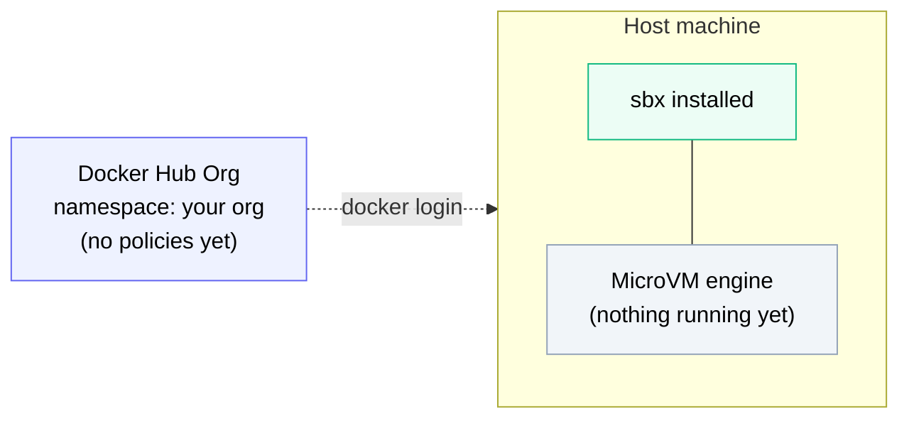

# Setup



*The starting point: a Docker Hub org (just the namespace, no policies yet) and a host with `sbx` installed and its MicroVM engine available. Nothing else has been created — no policies, no secrets, no sandbox.*

!!! tip "Run the interactive Labspace"
    This lab is also available as a self-contained, click-to-run **Labspace** at
    [github.com/ajeetraina/labspace-docker-ai-governance](https://github.com/ajeetraina/labspace-docker-ai-governance).

    ```bash
    git clone https://github.com/ajeetraina/labspace-docker-ai-governance
    cd labspace-docker-ai-governance
    bash start-labspace.sh
    ```

    Then open [http://localhost:3030](http://localhost:3030). The pages that follow mirror that Labspace content, adapted for this workshop.

Welcome to the Docker AI Governance lab.

Before you start, set the **organization** you'll be using throughout. Most commands and links in later sections substitute `<your-org>` for your organization.

Substitute `<your-org>` with your Docker Hub organization (where you have admin rights).

## What you need

- **`sbx` (Docker Sandboxes)** installed - Docker Desktop is **not** required
- **Admin access** to a Docker Hub organization so you can configure AI governance policies
- **A terminal** - most commands are click-to-run

## Pick your operating system

Choose the platform you're running `sbx` on. Later sections use this to show you the right install commands and file paths.

## Quick check

Verify sbx is installed:

```bash
sbx version
```

If it's not installed, then run the install command for your platform:

=== "macOS"

    ```bash
    brew install docker/tap/sbx
    ```

=== "Windows"

    !!! warning "Important"
        `sbx` runs **natively** on Windows 11 (x86_64) using the Windows Hypervisor Platform - **not** inside WSL2. Enable the platform first, then reboot before installing.

    First enable the Windows Hypervisor Platform (elevated PowerShell), then **reboot** - this changes boot-time kernel components:

    ```powershell
    Enable-WindowsOptionalFeature -Online -FeatureName HypervisorPlatform -All
    ```

    After rebooting, install with WinGet:

    ```powershell
    winget install -h Docker.sbx
    ```

    Or download `DockerSandboxes.msi` from the [releases page](https://github.com/docker/sbx-releases/releases) and install it:

    ```powershell
    msiexec /i DockerSandboxes.msi /quiet
    ```

=== "Linux"

    On Ubuntu (`.deb`):

    ```bash
    sudo apt install ./DockerSandboxes-linux-amd64-ubuntu2604.deb
    ```

    On Rocky Linux 8 (`.rpm`):

    ```bash
    sudo dnf install ./DockerSandboxes-linux-amd64-rockylinux8.rpm
    ```

    Or use the Docker apt repository:

    ```bash
    curl -fsSL https://get.docker.com | sudo REPO_ONLY=1 sh
    sudo apt-get install docker-sbx
    ```

    Grant KVM access so sandboxes can boot, then reload your group membership:

    ```bash
    sudo usermod -aG kvm $USER && newgrp kvm
    ```

Verify you're logged in to Docker:

```bash
docker login
```

If you're a member of multiple organizations, make sure the org you set above (`<your-org>`) matches one where you have admin rights - otherwise you won't be able to set policies in the **Network Enforcement Demo**.

When you're ready, move to **Why AI Governance**.
