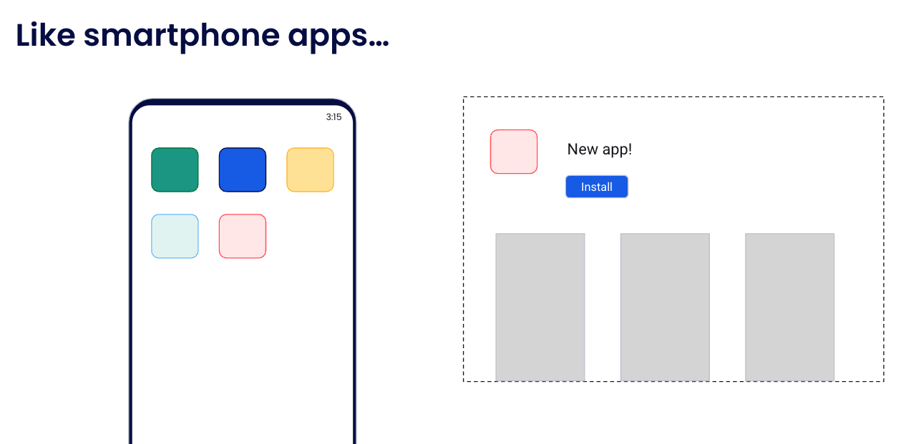

Let’s compare containers to smartphone apps. 

Most of us have smartphones that have lots of apps installed on them.

When is the last time you thought about how to install the dependencies for one of those apps, how to configure it, and how to set it up? Well, probably never.

We typically just open the app store, click the Install button <CLICK>, and then the app is there.

And when we open the newly installed red app, we don’t have to worry about how the dependencies and libraries for the green app are going to affect it - they all run in isolated or sandboxed environments.

Containers bring this same idea to other types of applications and services, although they are implemented a little differently.
