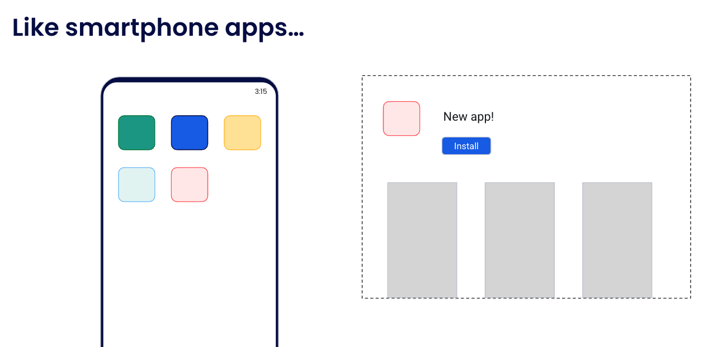

Let’s compare containers to smartphone apps. 

Most of us have smartphones that have lots of apps installed on them.

When is the last time you thought about how to install the dependencies for one of those apps, how to configure it, and how to set it up? Well, probably never.

We typically just open the app store, click the Install button <CLICK>, and then the app is there.

And when we open the newly installed red app, we don’t have to worry about how the dependencies and libraries for the green app are going to affect it - they all run in isolated or sandboxed environments.

Containers bring this same idea to other types of applications and services, although they are implemented a little differently.

## What are containers?

Simply put, containers are isolated processes for each of your app's components. 
Each component - the frontend React app, the Python API engine, and the database - runs in its own isolated environment, completely isolated from everything else on your machine.

Here's what makes them awesome. Containers are:

- Self-contained. Each container has everything it needs to function with no reliance on any pre-installed dependencies on the host machine.
- Isolated. Since containers run in isolation, they have minimal influence on the host and other containers, increasing the security of your applications.
- Independent. Each container is independently managed. Deleting one container won't affect any others.
- Portable. Containers can run anywhere! The container that runs on your development machine will work the same way in a data center or anywhere in the cloud!

## Containers versus virtual machines (VMs)

Without getting too deep, a VM is an entire operating system with its own kernel, hardware drivers, programs, and applications. 
Spinning up a VM only to isolate a single application is a lot of overhead.

A container is simply an isolated process with all of the files it needs to run. 
If you run multiple containers, they all share the same kernel, allowing you to run more applications on less infrastructure.

## What is Docker?

Docker is an open platform for developing, shipping, and running applications. 
Docker enables you to separate your applications from your infrastructure so you can deliver software quickly. 
With Docker, you can manage your infrastructure in the same ways you manage your applications. 
By taking advantage of Docker's methodologies for shipping, testing, and deploying code, you can significantly reduce the delay between writing code and running it in production.

