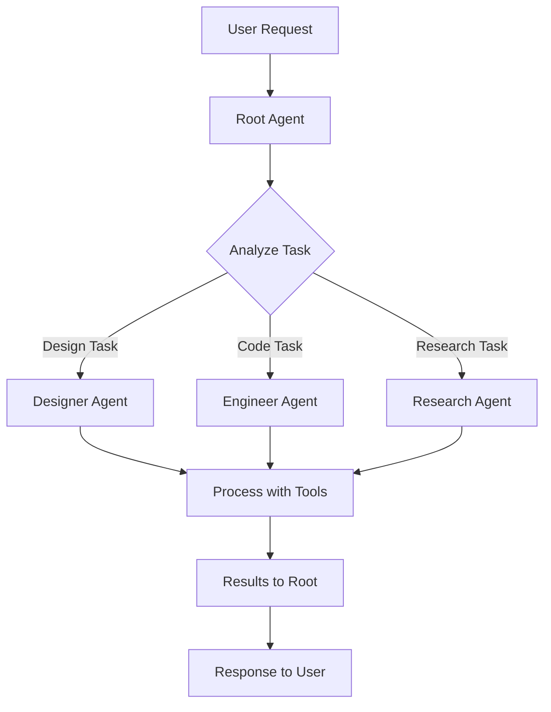

# How It Works

Understanding the internal architecture and mechanisms that power cagent's multi-agent orchestration.

## 1. Agent Hierarchy

cagent uses a hierarchical structure where root agents coordinate with specialized sub-agents:

```
Root Agent (Coordinator)
├── Sub-Agent 1 (Specialist)
├── Sub-Agent 2 (Specialist)
└── Sub-Agent 3 (Specialist)
```

The root agent receives all user requests and intelligently delegates to appropriate specialists.

## 2. Task Delegation Flow



**Step-by-step process:**

1. User sends request to root agent
2. Root agent analyzes task complexity and domain
3. Routes to appropriate sub-agent if specialized knowledge needed
4. Sub-agent processes task using its tools and expertise
5. Results flow back through root agent to user

## 3. Built-in Tools Available

| Tool | Description | Use Case |
|------|-------------|----------|
| `filesystem` | Read/write files safely | Code editing, file management |
| `todo` | Task management across agents | Project tracking |
| `memory` | Persistent SQLite storage | Long-term context |
| `think` | Step-by-step reasoning | Complex problem solving |
| `shell` | Execute commands securely | Development tasks |
| `transfer_task` | Agent-to-agent delegation | Multi-agent coordination |

## 4. MCP Tool Integration

External tools run in isolated containers through MCP (Model Context Protocol):

```yaml
toolsets:
  - type: mcp
    command: "docker"
    args: ["mcp", "gateway", "run", "--servers=duckduckgo"]
  
  - type: mcp
    command: "uvx"
    args: ["mcp-server-postgresql"]
```

**Benefits of MCP integration:**

- Access to hundreds of pre-built tool servers
- Secure container isolation
- Consistent interface across tools
- Easy to add new capabilities

## 5. Multiple Interfaces

cagent supports multiple ways to interact:

### CLI Mode

```bash
./bin/cagent run config.yaml
```

### Web Interface

```bash
./bin/cagent web -d ./configs ./sessions.db
```

### MCP Server Mode

```bash
./bin/cagent mcp server --port 8080 --agents-dir ./configs
```

The same agent configurations work across all interfaces.

## 6. Docker Integration

Share agents like container images:

```bash
# Push agent to Docker Hub
./bin/cagent push ./agent.yaml namespace/agent-name

# Pull shared agent
./bin/cagent pull namespace/agent-name
```

This enables:

- Version-controlled agent configurations
- Easy sharing within teams
- Reproducible agent deployments
- Docker Hub as an agent registry

## 7. Interactive Commands

During conversations, these commands are available:

| Command | Action |
|---------|--------|
| `/exit` | End session |
| `/reset` | Clear conversation history |
| `/eval` | Save conversation for evaluation |

## 8. Agent Generation

Create agents from natural language descriptions:

```bash
./bin/cagent new
```

This interactive prompt generates agent configurations based on your requirements.

## Architecture Overview

cagent uses a layered architecture:

```
┌─────────────────────────────────────────────┐
│         Command Layer                        │
│    (CLI, Web, TUI, MCP Server interfaces)   │
├─────────────────────────────────────────────┤
│         ServiceCore Layer                    │
│  (Multi-tenant business logic, isolation)   │
├─────────────────────────────────────────────┤
│         Agent System                         │
│  (Hierarchical delegation, task routing)    │
├─────────────────────────────────────────────┤
│         Runtime System                       │
│  (Event-driven execution, streaming)        │
├─────────────────────────────────────────────┤
│         Tool System                          │
│  (Built-in tools + MCP integration)         │
├─────────────────────────────────────────────┤
│         Model Providers                      │
│  (OpenAI, Anthropic, Gemini, DMR)           │
└─────────────────────────────────────────────┘
```

All layers work together to provide secure, scalable multi-agent orchestration.

## Key Architectural Benefits

- **Modularity**: Each layer can be extended independently
- **Security**: Container isolation at the tool layer
- **Scalability**: Distribute workload across agent teams
- **Flexibility**: Mix and match models, tools, and interfaces
- **Enterprise-ready**: Multi-tenant support with proper secrets management
