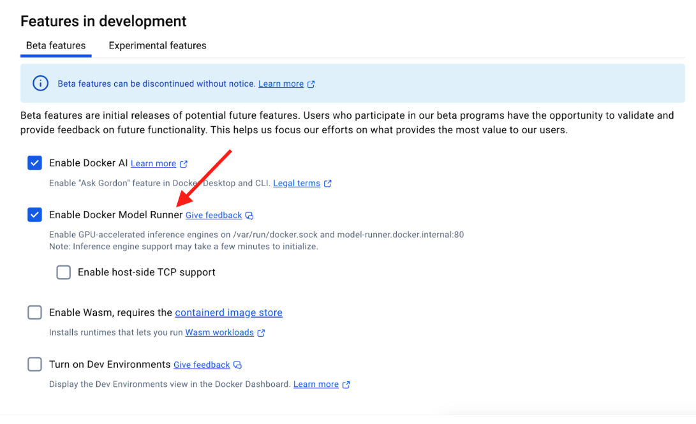

## Prereq

- Install the latest version of [Docker Desktop 4.40+](https://docs.docker.com/get-started/introduction/get-docker-desktop/)
- Ensure that “Docker Model Runner” is enabled (it should by default in 4.40) 

There are two ways to enable Model Runner - either using CLI or using Docker Dashboard.

### Using CLI

```
docker desktop enable model-runner
```

### Using Docker Dashboard




> The "Enable host-side TCP support" feature allows Docker Model Runner to  additionally accept connections on the host OS on the specified TCP port (default: 12434) rather than only through the host Docker socket (/var/run/docker.sock). You can change this to another port if needed, particularly if 12434 is already in use by another application. We will see its usage later in the docs.


Once you enable the option, select “Apply & Restart”.


> If you’re not seeing the “Enable Model Runner” option, it is recommended to enable “Use nightly builds” option under Software Updates and try to see if the option is available. If still facing issue, reach out to Eva.


Open up the terminal and you should be able to see docker model as the new CLI.

```
docker model --help
Usage:  docker model COMMAND

Docker Model Runner

Commands:
  inspect     Display detailed information on one model
  list        List the available models that can be run with the Docker Model Runner
  pull        Download a model
  rm          Remove a model downloaded from Docker Hub
  run         Run a model with the Docker Model Runner
  status      Check if the Docker Model Runner is running
  version     Show the Docker Model Runner version

Run 'docker model COMMAND --help' for more information on a command.
```

## Check if the Model Runner is running or not


```
docker model status
Docker Model Runner is running
```

## List the available models

```
docker model ls
MODEL  PARAMETERS  QUANTIZATION  ARCHITECTURE  FORMAT  MODEL ID  CREATED  SIZE
```

The response shows an empty list.
Let’s go ahead and download the model from the Docker Hub.


## Download a model


```
docker model pull ai/llama3.2:1B-Q8_0
```

All these models are hosted on [https://hub.docker.com/u/ai](https://hub.docker.com/u/ai): 

```
ai/gemma3
ai/llama3.2
ai/qwq
ai/mistral-nemo
ai/mistral
ai/phi4
ai/qwen2.5
ai/deepseek-r1-distill-llama (distill means it’s not the actual RL-ed deepseek, it’s a llama trained on DeepSeek-R1 inputs/outputs) 
```
More models will be coming in the future, we plan to add more popular ones first. 

## List the Model

```
docker model ls
MODEL                PARAMETERS  QUANTIZATION  ARCHITECTURE  MODEL ID      CREATED       SIZE
ai/llama3.2:1B-Q8_0  1.24 B      Q8_0          llama         a15c3117eeeb  20 hours ago  1.22 GiB
```

## Use docker model run to send a single message


```
docker model run ai/llama3.2:1B-Q8_0 "Hi"
Hello! How can I help you today?
```

## Run the Model in interactive mode 

```
docker model run ai/llama3.2:1B-Q8_0
Interactive chat mode started. Type '/bye' to exit.
> why is water blue?
Water appears blue because ...
```

## Remove the model

```
docker model rm ai/llama3.2:1B-Q8_0
```

## Packaging your own AI Model

### Step 1. Pull the model from Hugging Face


```
docker model pull hf.co/bartowski/Llama-3.2-1B-Instruct-GGUF
Downloaded: 769.73 MB
Model pulled successfully
```
### Step 2. Setup a local Docker registry


```
docker run -d -p 5000:5000 --name registry registry:2
```
### Step 3. Tag the model for your local registry

```
docker model tag hf.co/bartowski/Llama-3.2-1B-Instruct-GGUF localhost:5000/foobar
Model "hf.co/bartowski/llama-3.2-1b-instruct-gguf" tagged successfully with "localhost:5000/foobar:latest"
```

### Step 4. Push the model to your local registry

```
docker model push localhost:5000/foobar
Uploaded: 770.00 MB
Model pushed successfully
```     
### Step 5. Push the model to your local registry

```
docker model push localhost:5000/foobar
Uploaded: 770.00 MB
Model pushed successfully
```
   
### Step 6. List the available models         

```
docker model ls
MODEL NAME                                  PARAMETERS  QUANTIZATION  ARCHITECTURE  MODEL ID      CREATED       SIZE
ai/llama3.2:1B-Q8_0                         1.24 B      Q8_0          llama         a15c3117eeeb  2 months ago  1.22 GiB
hf.co/bartowski/llama-3.2-1b-instruct-gguf  1.24B                     llama         7ca6390d8288  8 months ago  808M
localhost:5000/foobar:latest  
```

