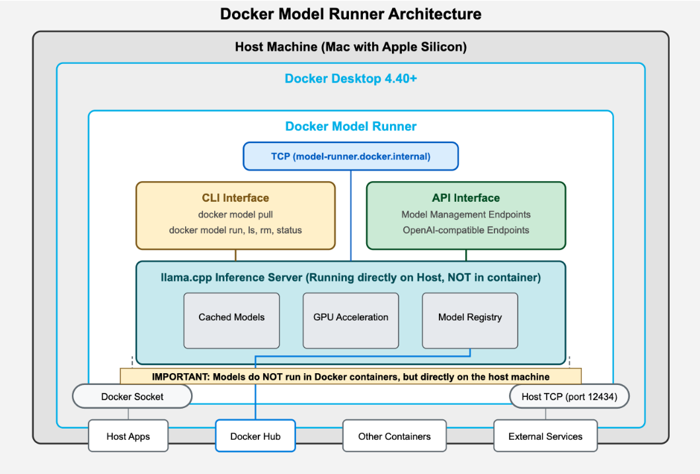

## Docker Model Runner

- Docker Model Runner is a new experimental feature introduced in Docker Desktop for Mac 4.40+. 
- It provides a Docker-native experience for running Large Language Models (LLMs) locally, seamlessly integrating with existing container tooling and workflows. 
- The feature is specifically optimized to utilize Apple Silicon Mac's GPU resources for efficient model inference as of now. 

## What problem does it solve?

With the Model Runner feature, Docker provides inference capabilities to developers on their laptop, and in the future in CI, allowing them to run LLM models locally. This is an important feature to help developing GenAI applications. The runner essentially provides GPU-accelerated inference engines that are accessible both through the Docker socket (`/var/run/docker.sock`) and via a TCP connection at `model-runner.docker.internal:80`.

## New `docker model` CLI


Docker Desktop 4.40+ introduces `docker model` CLI as the first class-citizen. This means AI models are now treated as fundamental, well-supported objects within the Docker CLI, similar to how Docker already treats containers, images, and volumes. 

```
docker model --help
Usage:  docker model COMMAND

Docker Model Runner

Commands:
  inspect     Display detailed information on one model
  list        List the available models that can be run with the Docker Model Runner
  pull        Download a model
  rm          Remove a model downloaded from Docker Hub
  run         Run a model with the Docker Model Runner
  status      Check if the Docker Model Runner is running
  version     Show the Docker Model Runner version

Run 'docker model COMMAND --help' for more information on a command.
```

By using this new CLI, developers can:

- Pull models from registries (e,g Docker Hub)
- Run models locally with GPU acceleration
- Integrate models into their development workflows
- Test GenAI applications during development without relying on external APIs

This capability is particularly valuable for developing and testing GenAI applications locally before deployment, allowing for faster iteration cycles and reduced dependency on cloud services during development.

## Architecture of Docker Model Runner




With Docker Model Runner, the AI model DOES NOT run in a container. Instead, Docker Model Runner uses a host-installed inference server (llama.cpp for now) that runs natively on your Mac rather than containerizing the model. We do plan to support additional inference (i.e MLX) in future releases.

### 1. Host-level process:

Docker Desktop runs llama.cpp directly on your host machine
This allows direct access to the hardware GPU acceleration on Apple Silicon


### 2. GPU acceleration:

By running directly on the host, the inference server can access Apple's Metal API
This provides direct GPU acceleration without the overhead of containerization
You can see the GPU usage in Activity Monitor when queries are being processed


### 3. Model Loading Process:

When you run docker model pull, the model files are downloaded from the Docker Hub
These models are cached locally on the host machine's storage 
Models are dynamically loaded into memory by llama.cpp when needed

> Note: Unlike traditional Docker containers that package large AI models with > the model runtime (which results in slow deployment), Model Runner separates > the model from the runtime, allowing for faster deployment. 

> Model Runner enables local LLM execution. It runs large language models 
> (LLMs) directly on your machine rather than sending data to external API 
> services. This means your data never leaves your infrastructure. All you need > to do is pull the model from Docker Hub and start integrating it with your 
> application.

