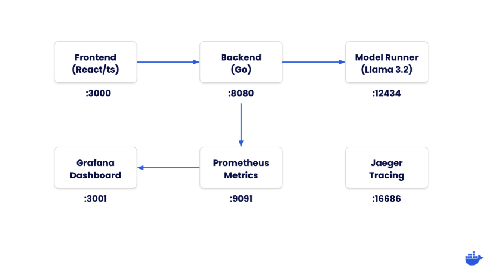
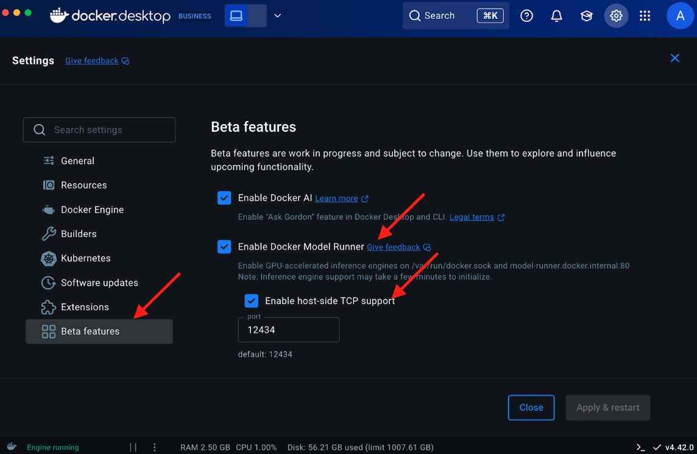
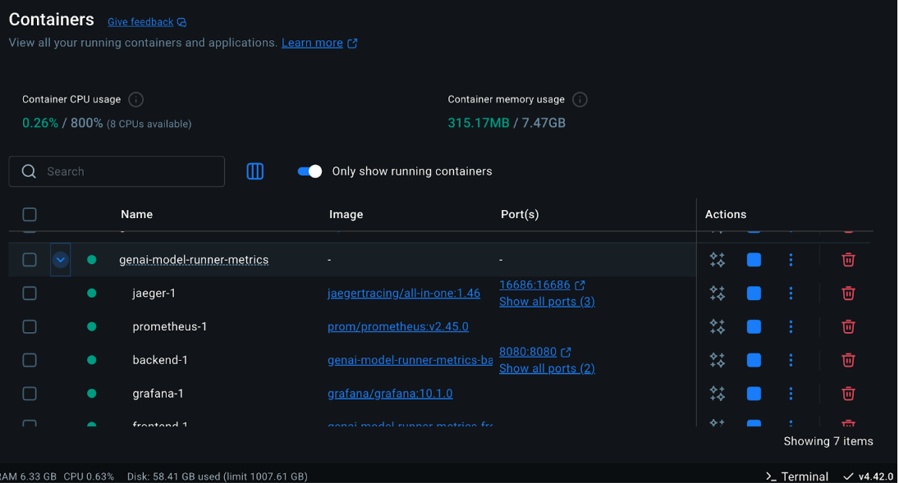
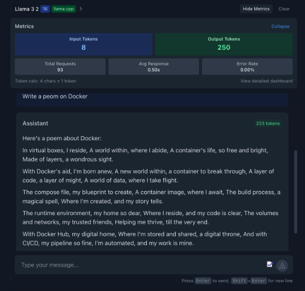
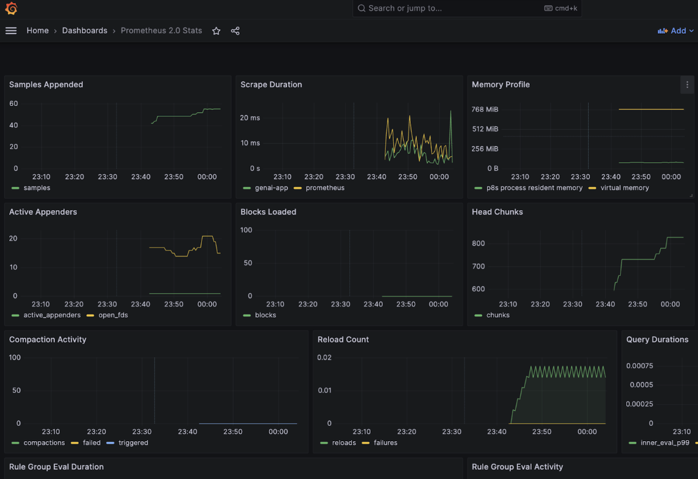
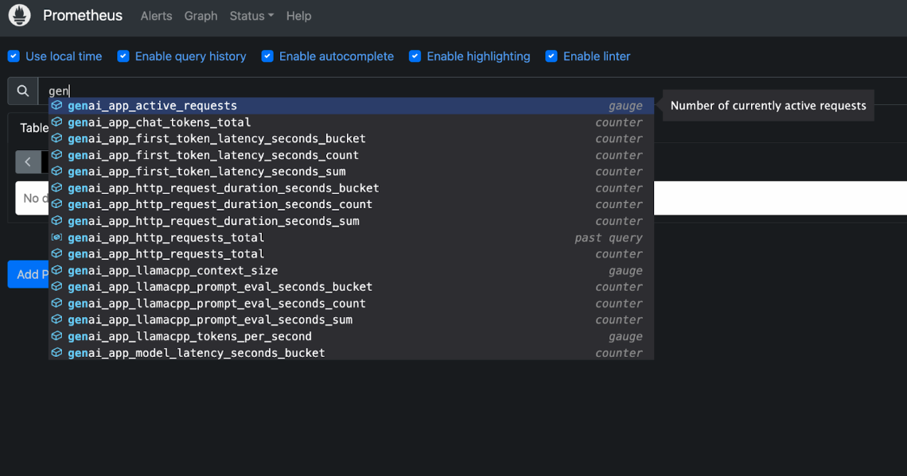

A modern, full-stack chat application demonstrating how to integrate React frontend with a Go backend and run local Large Language Models (LLMs) using Docker's Model Runner.

This repo also integrates the GenAI app with the Observability stack that includes Prometheus, Grafana and Jaeger.

## Overview

This project showcases a complete Generative AI interface that includes:

-  React/TypeScript frontend with a responsive chat UI
-  Go backend server for API handling
-  Integration with Docker's Model Runner to run Llama 3.2 locally
-  Comprehensive observability with metrics, logging, and tracing
-  llama.cpp metrics integration directly in the UI

## Architecture

The application consists of these main components:



## Prerequisites

Before we begin, make sure you have:

- Docker Desktop (version 4.40 or newer) 
- Docker Model Runner enabled
- At least 16GB of RAM for running AI models efficiently
- Familiarity with Go (for backend development)
- Familiarity with React and TypeScript (for frontend development)


### Clone the repository

```
git clone https://github.com/dockersamples/genai-model-runner-metrics
cd genai-model-runner-metrics
```

### Enable Docker Model Runner in Docker Desktop

Go to Settings > Features in Development > Beta tab
Enable "Docker Model Runner"
Select “Apply and restart”




### Download the model

```
docker model pull ai/llama3.2:1B-Q8_0
```

## Verify the backend.env 

```
BASE_URL=http://host.docker.internal:12434/engines/llama.cpp/v1/
MODEL=ai/llama3.2:1B-Q8_0
API_KEY=${API_KEY:-dockermodelrunner}

# Observability configuration
LOG_LEVEL=info
LOG_PRETTY=true
TRACING_ENABLED=true
OTLP_ENDPOINT=jaeger:4318
```


### Start the application using Docker Compose

```
docker compose up -d --build
```



You can access the frontend at [http://localhost:3000](http://localhost:3000)




To access Grafana, use the following address: [http://localhost:3001](http://localhost:3001) (admin/admin)


  
Ensure that you provide `http://prometheus:9090` instead of `localhost:9090` to see the metrics on the Grafana dashboard.

   - Jaeger UI: [http://localhost:16686](http://localhost:16686)
   - Prometheus: [http://localhost:9091](http://localhost:9091)



## How It Works

1. The frontend sends chat messages to the backend API
2. The backend formats the messages and sends them to the Model Runner
3. The LLM processes the input and generates a response
4. The backend streams the tokens back to the frontend as they're generated
5. The frontend displays the incoming tokens in real-time
6. Observability components collect metrics, logs, and traces throughout the process

