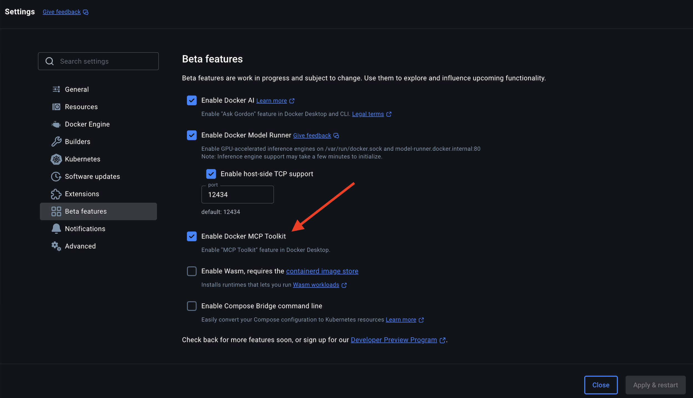

## Prereq

Ensure that you have Docker Desktop 4.42+ installed on your system.

## Using the Docker MCP CLI

The `docker mcp` CLI is a powerful command-line tool that serves as the interface for managing the Docker Model Context Protocol (MCP) environment. 
It enables developers to connect AI assistants to external tools securely, without having to manually configure each connection.

As part of the Docker MCP Toolkit, this CLI brings the legendary Docker simplicity to the world of AI agent tooling.

```
$ docker mcp
Usage: docker mcp [OPTIONS]

Flags:
  -v, --version   Print version information and quit

Available Commands:
  catalog     Manage the catalog
  client      Manage MCP clients
  gateway     Manage the MCP Server gateway
  policy      Manage secret policies
  secret      Manage secrets
```

The Docker MCP CLI is currently a plugin for Docker Desktop. 
When you first run an MCP command, it will check if the extension is installed or not.

## Key Features

The Docker MCP CLI provides several key capabilities:

- **Catalog Management**: Browse, search, and manage MCP tools directly from the command line
- **Client Management**: Connect and disconnect MCP clients like Claude, VS Code, and Cursor
- **Secret Management**: Securely store and manage credentials for MCP tools
- **Policy Management**: Create and enforce access policies for MCP secrets
- **Gateway Server**: Provides a single connection point for all enabled MCP tools


## Getting Started


### 1.  Ensure that MCP Toolkit is enabled on Docker Desktop




```
docker mcp client ls -g
```

```
docker mcp client ls
=== Project-wide MCP Configurations (/Users/ajeetsraina/tesco/docker-workshop) ===
 ● cursor: no mcp configured
 ● vscode: no mcp configured

```


### 2. Check the version


```
docker mcp -v
Docker MCP Plugin
dev, commit cb67dfd17ba46115f13869a87d5449e6a78110b1

```

### 3. Client Management 

The Docker MCP Toolkit enables seamless connection between AI assistant clients and the powerful tools available in the Docker MCP Catalog. Client management is a core functionality that allows you to connect, disconnect, and monitor the status of compatible AI clients like Claude, VS Code, Cursor, and more.
With the docker mcp client commands, you can easily establish connections that allow these AI assistants to leverage the full power of Docker's MCP tools. Once connected, clients can perform actions through the MCP protocol without complicated setup or direct access to sensitive credentials.

The Client Management interface provides a straightforward way to:

- Connect compatible AI clients to Docker MCP
- Disconnect clients when access is no longer needed
- List and verify connection status of all configured clients
- Set up connections at either project or system-wide level

This unified approach to client management simplifies what was previously a complex and fragmented process, bringing Docker's philosophy of simplicity and security to the AI tooling ecosystem.

### 4. Using the Client Management CLI

``` 
docker mcp client --help
Docker MCP Toolkit's CLI - Manage your MCP servers and clients.

Usage: docker mcp client (Supported: claude-desktop, continue, cursor, gordon, vscode)

Available Commands:
  connect             Connect the Docker MCP Toolkit to a client
  disconnect          Disconnect the Docker MCP Toolkit from a client
  ls                  List client configurations
```

### 5. Listing Clients

Check which clients are configured:

```shell
docker mcp client ls -g

=== System-wide MCP Configurations ===
 ● claude-desktop: no mcp configured
 ● continue: no mcp configured
 ● cursor: no mcp configured
 ● gordon: no mcp configured
 ● vscode: no mcp configured
```

The "no mcp configured" status means that while these clients are detected, they haven't been connected to Docker MCP yet. Neither client will have access to any MCP tools you enable in Docker.

### 6. Accessing the MCP Toolkit 


### 7. Connecting Clients


Currently, the supported clients are:

- gordon 
- claude-desktop
- continue
- cursor


In order to connect the clients to Docker, you use the following command:

```
docker mcp client connect --help
This Docker CLI plugin adds experimental features.

Usage: docker mcp client connect [OPTIONS] <mcp-client>

Supported clients: claude-desktop continue cursor gordon vscode
Flags:
-g, --global   Change the system wide configuration or the clients setup in your current git repo.
-q, --quiet    Only display errors.
```

