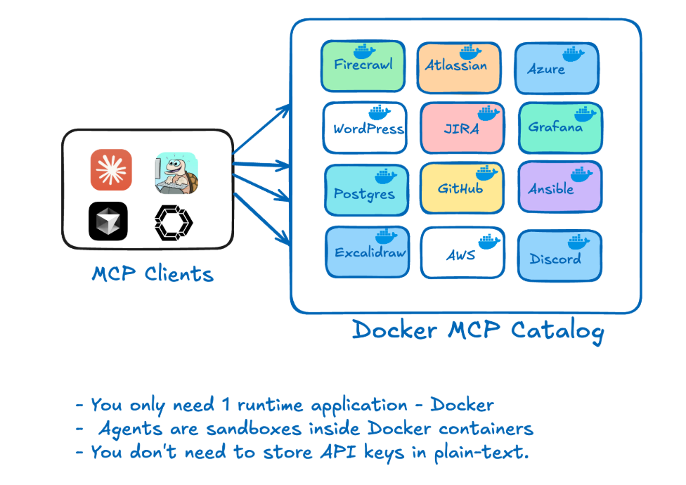

MCP refers to Model Context Protocol. It is an open protocol that standardizes how applications provide context to LLMs. 

Think of MCP like a USB-C port for AI applications. Just as USB-C provides a standardized way to connect your devices to various peripherals and accessories, MCP provides a standardized way to connect AI models to different data sources and tools.

## A Typical MCP Workflow

### User Interaction
- User submits a prompt (e.g., "Fetch me list of users in the Slack")
- Users interact through various interfaces/applications connected to MCP

### MCP Hosts
- Acts as central orchestration layer for the collaboration platform
- Contains MCP Clients with different applications (Claude, Cursor, etc.)
- Handles user interactions and connects to backend services

### Client-Server Communication Layer
- Initial Request: Client sends user's prompt to appropriate servers
- Initial Response: Servers provide initial processing results
- Notification: Ongoing updates as processing continues (enables feedback loops)

### Tool Selection
- Determines which tools are appropriate for fulfilling user requests
- Bridges client and server sides by matching user needs with available capabilities

### MCP Servers
- Backend services that process requests, including:
- Kubernetes (container orchestration)
- Slack (communication)
- GitHub (code and version control)
- PostgreSQL (database operations)
- Grafana (monitoring and analytics)

### Capabilities Branches
- Tools: Specific utilities that servers employ to fulfill requests
- Resources: Assets and data available to the system
- Prompts: Template instructions for guiding LLM interactions

### Data Sources
- Database: Structured data storage
- Web Server: Internet-accessible resources
- Local Files: Filesystem resources

### Additional Components

- Notification: Alert system that ensures prompt delivery of results when operations complete
- Sampling: Process for selecting representative data from large datasets to balance accuracy with computational efficiency

## Challenges with the MCP Landscape

However, the current MCP experience faces several challenges:

- **Fragmented Discovery**: Developers struggle to find MCP servers across registries, community lists, and blog posts—with no way to verify which are official and trustworthy.
- **Complex Setup**: Getting started requires cloning repositories, managing conflicting dependencies, and self-hosting services that often aren't containerized, hindering portability.
- **Security Concerns**: Many MCP tools run with full host access (via npx or uvx) without isolation or sandboxing. Credentials are commonly passed as plain text environment variables, exposing sensitive data.
- **Lack of Enterprise Readiness**: Current tools often miss critical features like policy enforcement, audit logs, and standardized security practices.

## How Docker solves these challenges

Docker is addressing these challenges with two complementary offerings:

### 1. Docker MCP Catalog: 

A trusted hub for discovering and accessing verified MCP servers, seamlessly integrated into Docker Hub with over 100 verified tools at launch.

URL: [https://hub.docker.com/catalogs/mcp](https://hub.docker.com/catalogs/mcp ) 

### 2. Docker MCP Toolkit: 

A suite of tools and services that make MCP servers secure, seamless, and instantly usable on your local machine or anywhere Docker runs.

URL: [https://open.docker.com/extensions/marketplace?extensionId=docker/labs-ai-tools-for-devs](https://open.docker.com/extensions/marketplace?extensionId=docker/labs-ai-tools-for-devs )

## Docker as a MCP Runtime

Every time a new MCP server is added, a config file needs to be updated and the MCP client needs to be updated. The current workaround is to develop MCP servers which configure new MCP servers, but even this requires reloading. 

 

A much better approach is to simply use one MCP server: Docker. This MCP server acts as a gateway into a dynamic set of containerized tools.

