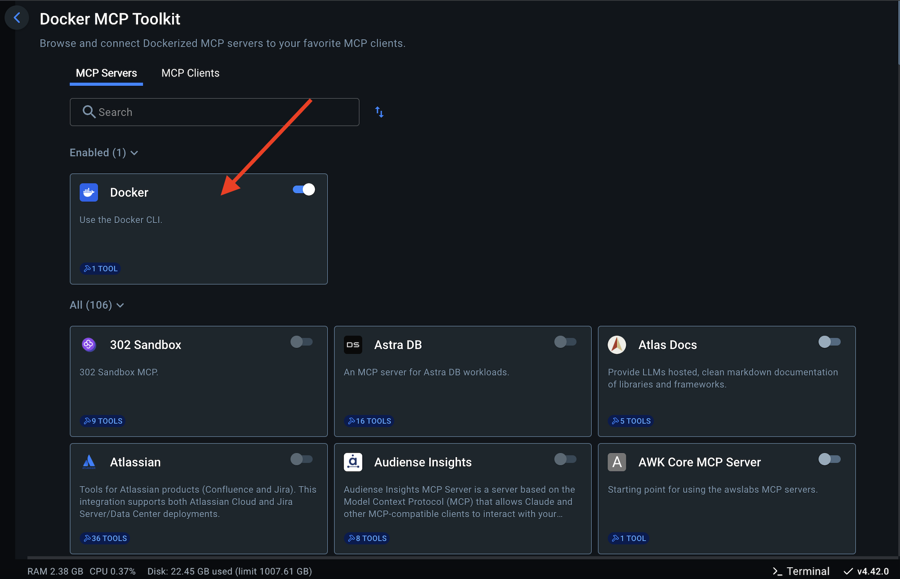
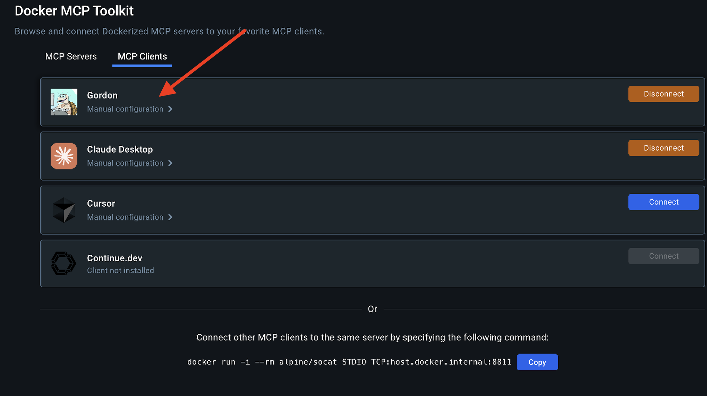
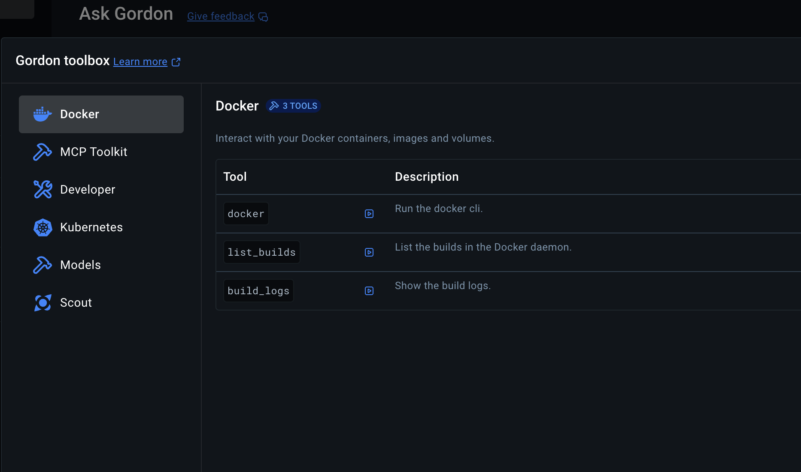
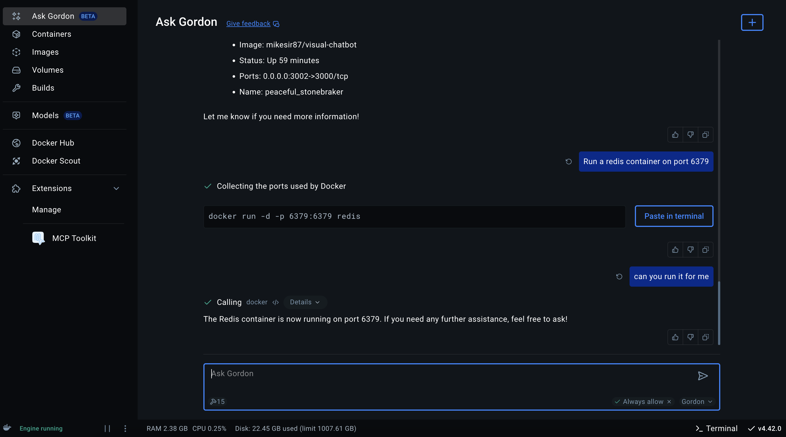

## Prerequisites

Before we start, make sure you have:

- Docker Desktop 4.42.0+ with the MCP Toolkit Extension installed
- Ensure that Docker AI is enabled under Docker Dashboard

## Step 1. Select Docker CLI under MCP Server

## Step 2. Select Gordon under MCP Client

## Step 3. Ensure that Docker CLI is enabled under Ask Gordon

## Prompt 1: 

"List out all the containers running on my system"

## Prompt 2:

"Create a new redis container with the name 'myredis' and run it on port 6379"

