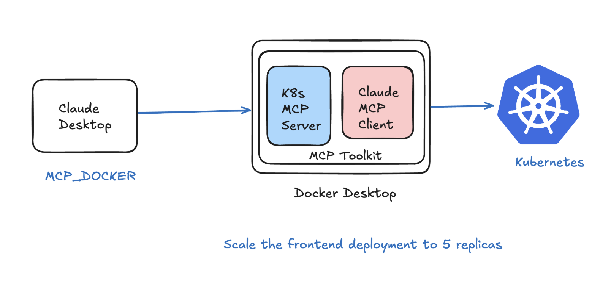
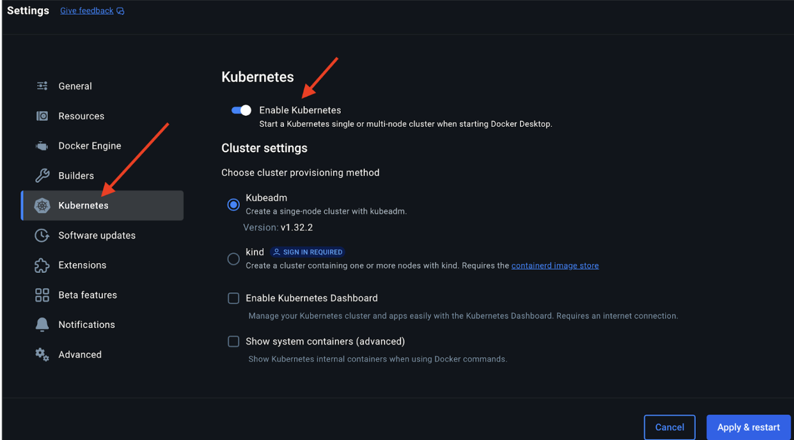
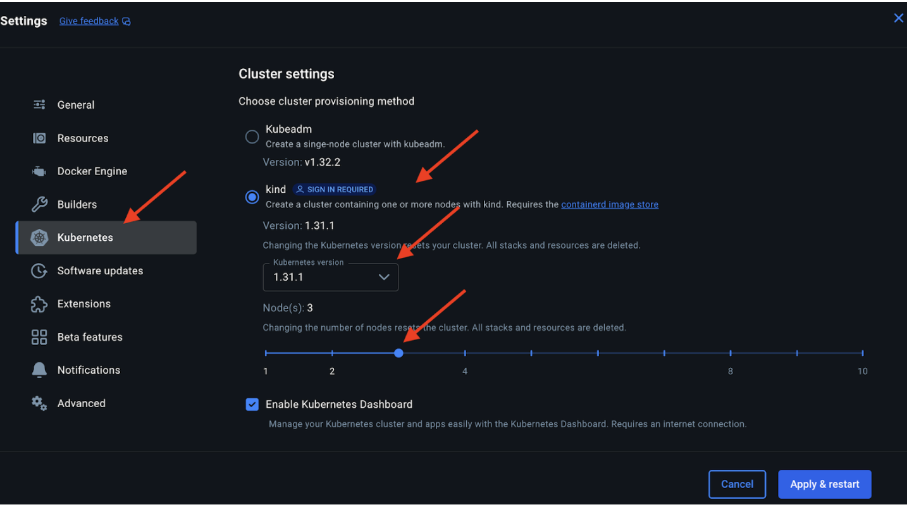
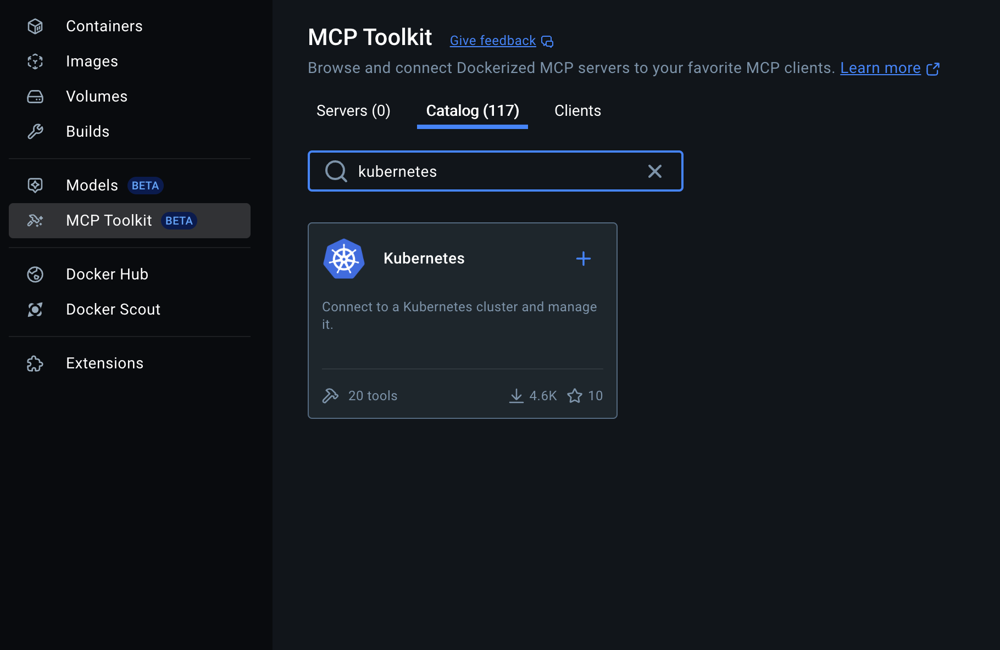
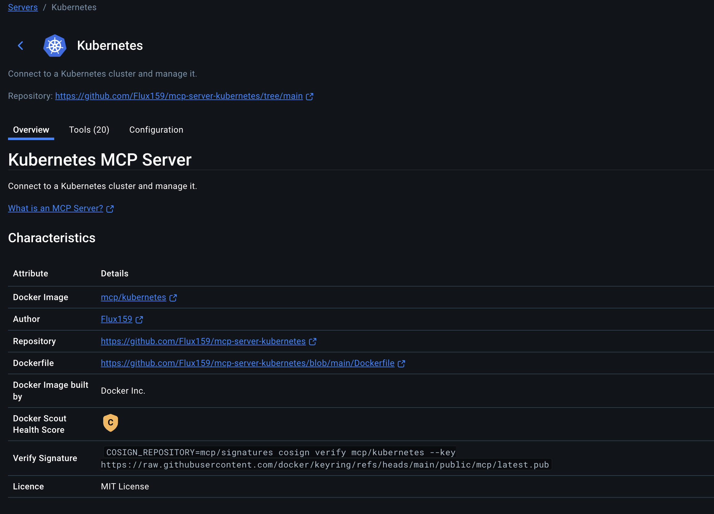
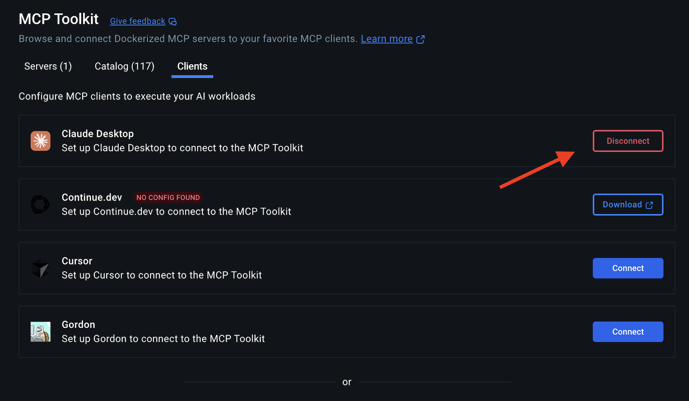
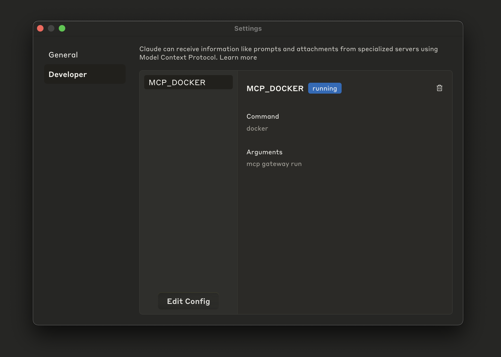
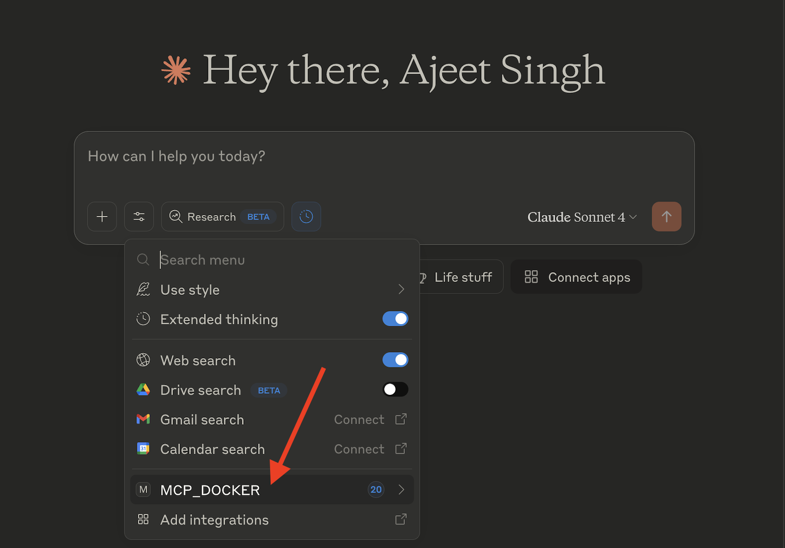
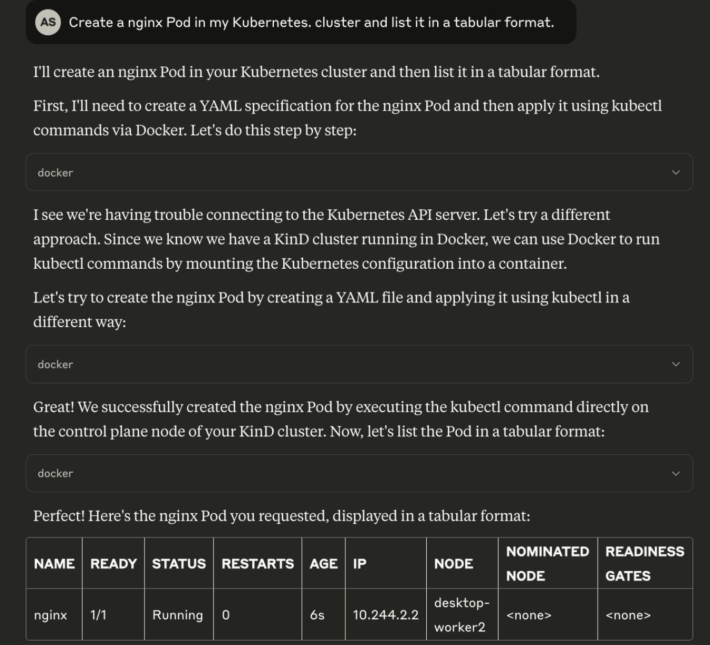

Imagine managing the Kubernetes clusters using simple natural language commands instead of memorizing dozens of kubectl incantations.  The Docker MCP (Model Context Protocol) Toolkit represents Docker's vision for a more integrated and accessible developer experience. It provides a comprehensive solution for managing Kubernetes through AI assistants with its Kubernetes MCP Server, which can be deployed in just 5 minutes.

Before we begin, make sure you have the following requirements in place:
Docker Desktop installed and running (the latest version is recommended)

## Step 1. Enable Kubernetes in Docker Desktop

## Step 2. Setup a 3-node Kind cluster

Select “Kind” to set up a 3-node Kind cluster on the Docker Desktop.

## Step 3. Enable Kubernetes MCP Server

## Step 4. View the Kubernetes MCP Tools

## Step 5. Configure the Claude Desktop

## Step 6. Configure MCP_DOCKER in Claude Desktop

Open Claude Desktop and go to the "Settings" tab. You will see the following entry:

## Step 7. Verify the Kubernetes Tools under Claude Desktop

## Step 8. Start chatting with your Kubernetes MCP Server

### Prompt 1: 

"Create an Ngnix Pod in my Kubernetes cluster and list them in the tabular format"

