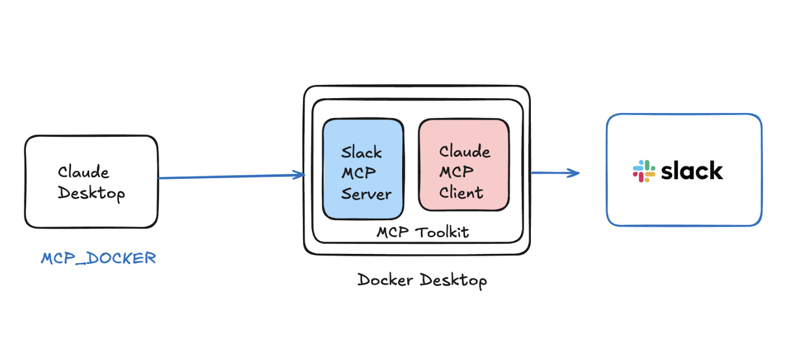
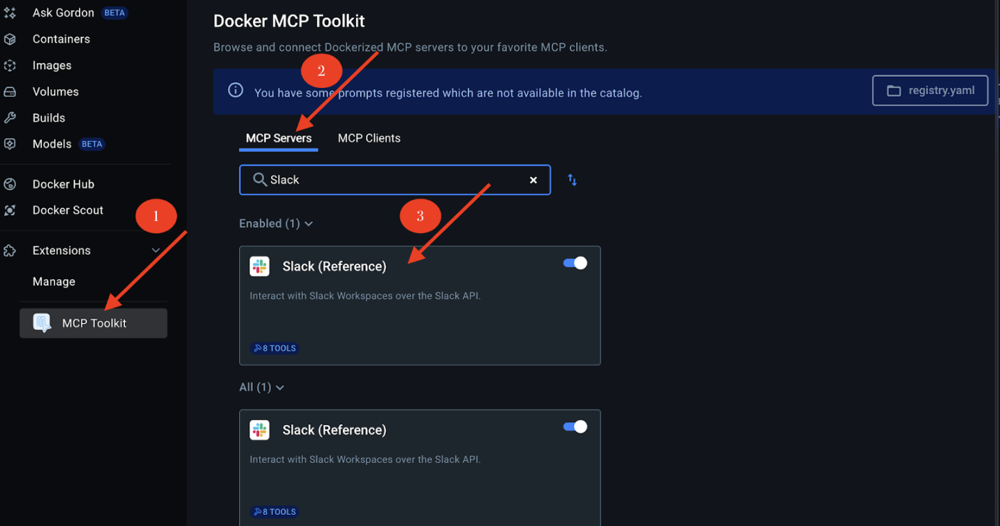
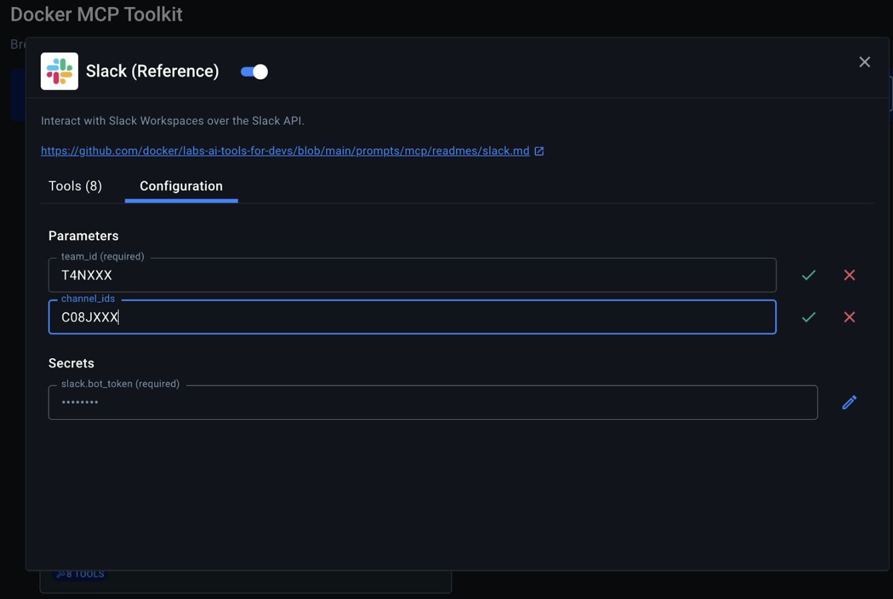
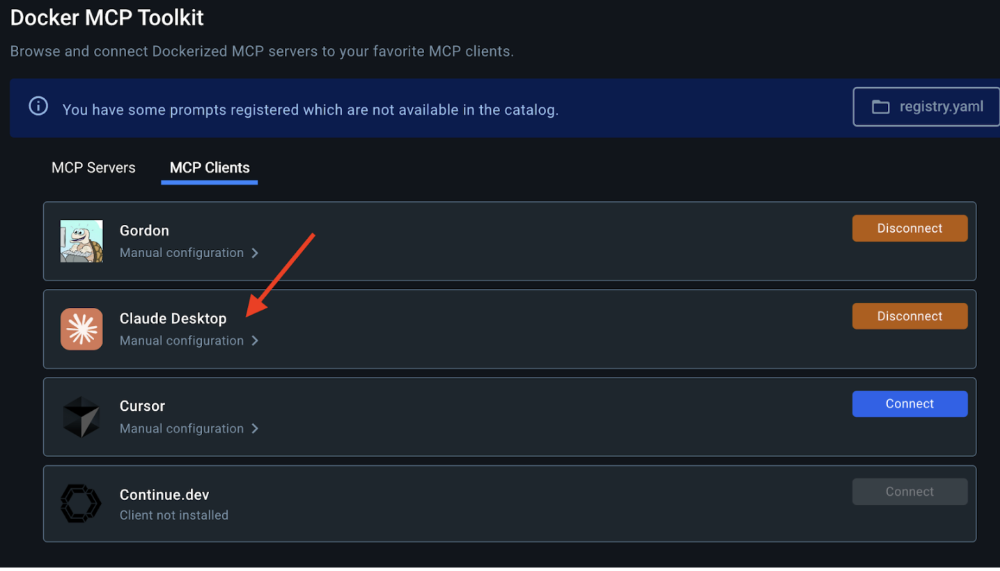
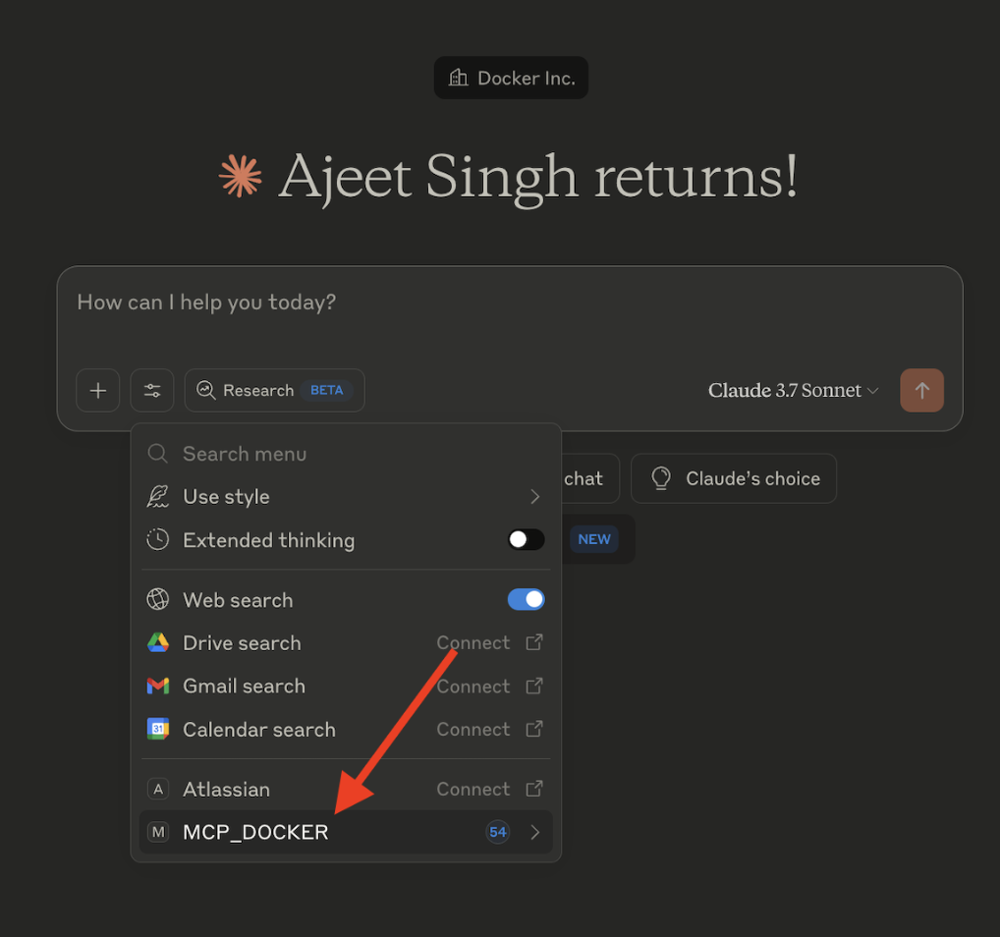
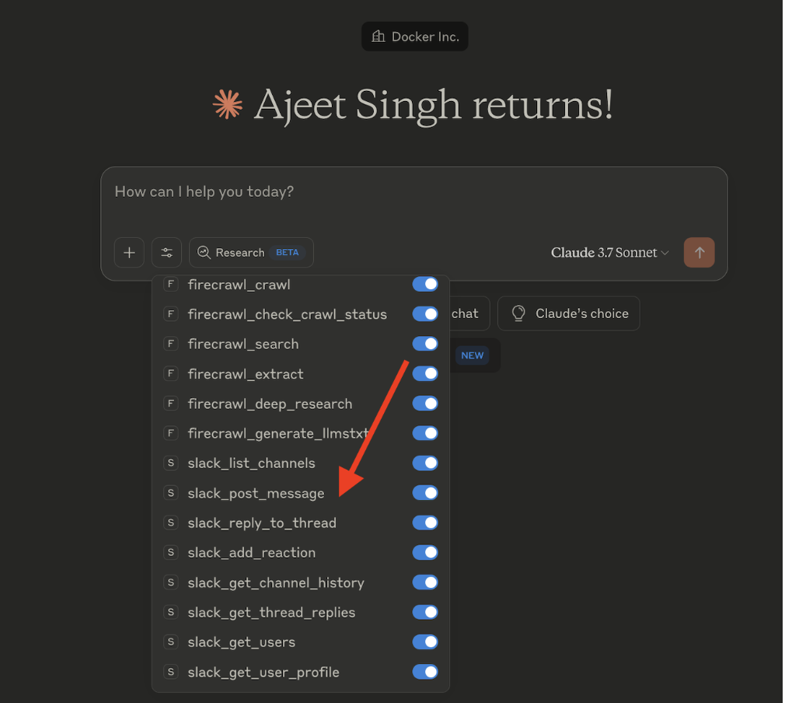
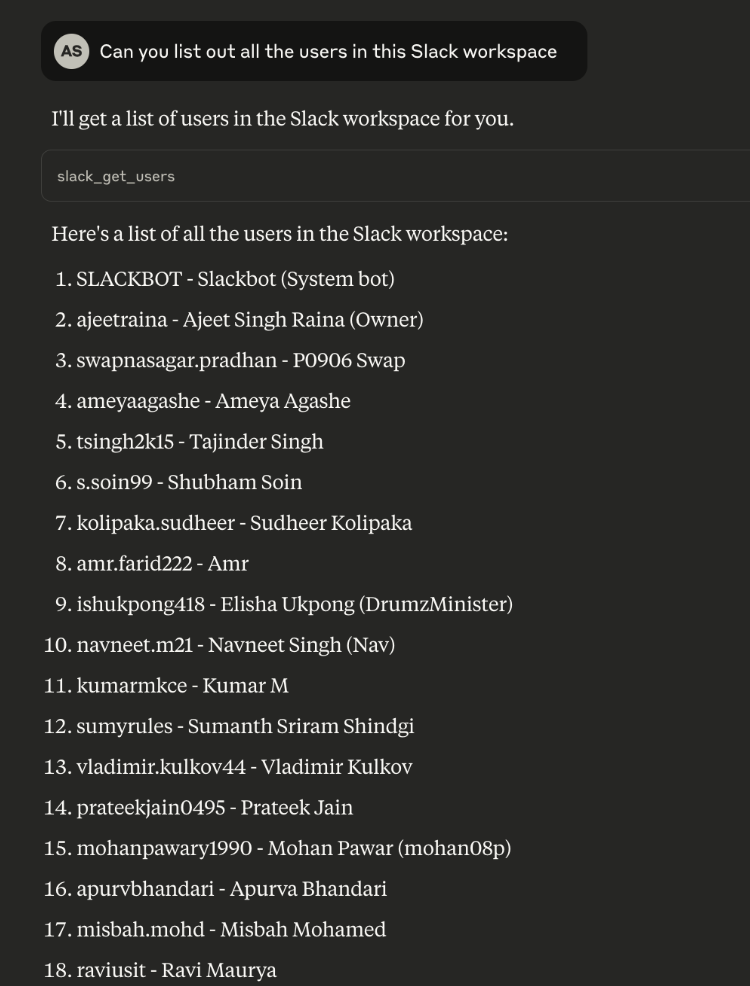

## Step 1. Create a Slack App and Get Required Credentials

First, you need to create a Slack app and get the necessary credentials:

- Go to the Slack API website and sign in to your Slack account
- Click "Create New App" and choose "From scratch"
- Name your app (e.g., "Claude MCP Integration") and select your workspace
- Once created, navigate to "OAuth & Permissions" in the sidebar
- Under "Bot Token Scopes", add the following permissions:

```
channels:history
channels:read
chat:write
reactions:write
users:read
```

- Scroll up and click "Install to Workspace"
- After installation, you'll receive a Bot User OAuth Token starting with "xoxb-"

## Step 2. Get Your Team ID and Channel ID

- In your Slack workspace, right-click on your workspace name in the top-left and select "Copy link"
- The link will look like https://app.slack.com/client/T01ABCDEFG/... - the T01ABCDEFG part is your Team ID
- To get a Channel ID, right-click on a channel and select "Copy link"
- The link will look like https://your-workspace.slack.com/archives/C01ABCDEFG - the C01ABCDEFG part is your Channel ID

By now, you must have the following details with you.

```
provider: slack
team_id: XXX
channel_id: XXX
Slack token: xoxb-1XXX
```
## Step 3. Configure Slack MCP Server

Ensure that the MCP Toolkit is enabled in Docker Desktop. 
If not, enable it from the Docker Desktop settings.



## Step 4. Configure the Slack MCP Server



## Step 5. Configure Claude Desktop as MCP Client



## Step 6. Verify if MCP_DOCKER appear under Claude Desktop



## Step 7. Pick up your preferred MCP tools



## Step 8. Start chatting with your Slack MCP Server




