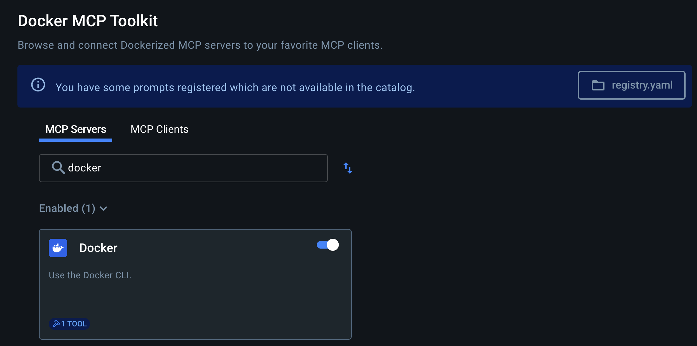

## Prerequisites

Before we start, make sure you have:

- Docker Desktop 4.41.0+ with the MCP Toolkit Extension installed
- Node.js (v18 or later) for running the frontend
- VS Code (or any IDE of your choice)

## Setting Up the Sample Database

Instead of using an empty Postgres database, let's use a real example with actual data.
We'll use a sample product catalog service:

## Step 1. Clone the sample catalog service

```
git clone https://github.com/ajeetraina/catalog-service-node
cd catalog-service-node
```

## Step 2. Start the backend services (includes Postgres with sample data)

```
docker compose up -d --build
```

This will spin up:


- A Postgres database on port 5432 with sample catalog data
- A Node.js backend service
- Sample data including products, categories, and inventory

Now let's bring up the frontend to see what data we're working with:


## Step 3. Install frontend dependencies

```
npm install
```

## Step 4. Start the development server

```
npm run dev
```

Open your browser to `http://localhost:5173 to see the catalog application.
This gives you a visual understanding of the data structure we'll be querying with Claude.


Hit "Create Product" button and start adding the new items to your Product catalog system.

Perfect! Now we have a realistic database to work with instead of an empty one.


## Step 5. Setting up MCP Toolkit

Open Docker Desktop and navigate to the MCP Toolkit section in the sidebar.

Enable Docker MCP Server



## Step 6. Configuring the VS Code 

Open your VS Code and install the MCP Toolkit extension if you haven't already.

## Step 7. Add MCP Server


## Step 8. Using GitHub Co-Pilot

It's time to use GitHub Co-Pilot to interact with the Docker CLI MCP server.
Select Agent under Co-Pilot and select tools that are available to chat.


## Step 8. Chatting with GitHub Co-Pilot

Prompt: "list out all the containers running on my Docker Desktop"


## Troubleshooting:

In case you face the following issuse:

```json
Reason: You may not include more than 128 tools in your request.
```

The fix is to reduce the number of tools in your request to 128 or fewer. 
You can do this by selecting only the necessary tools you want to use with GitHub Co-Pilot.
