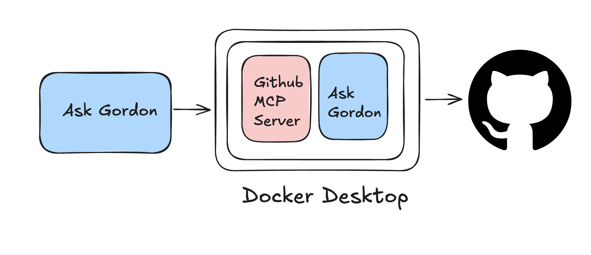
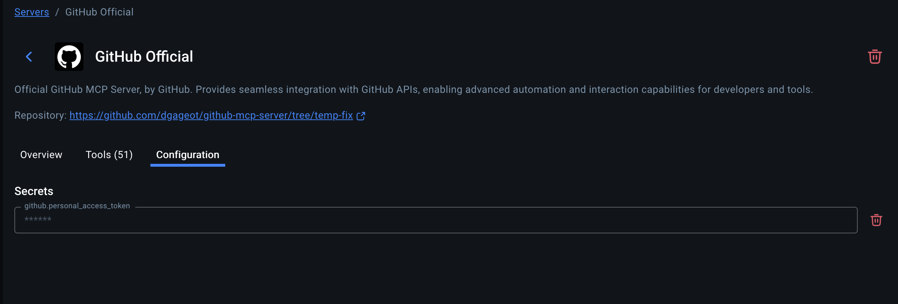
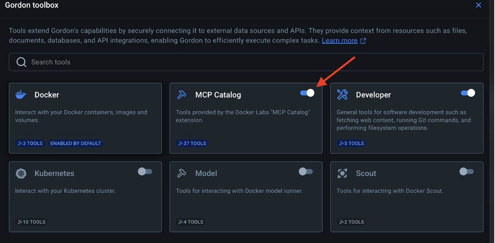
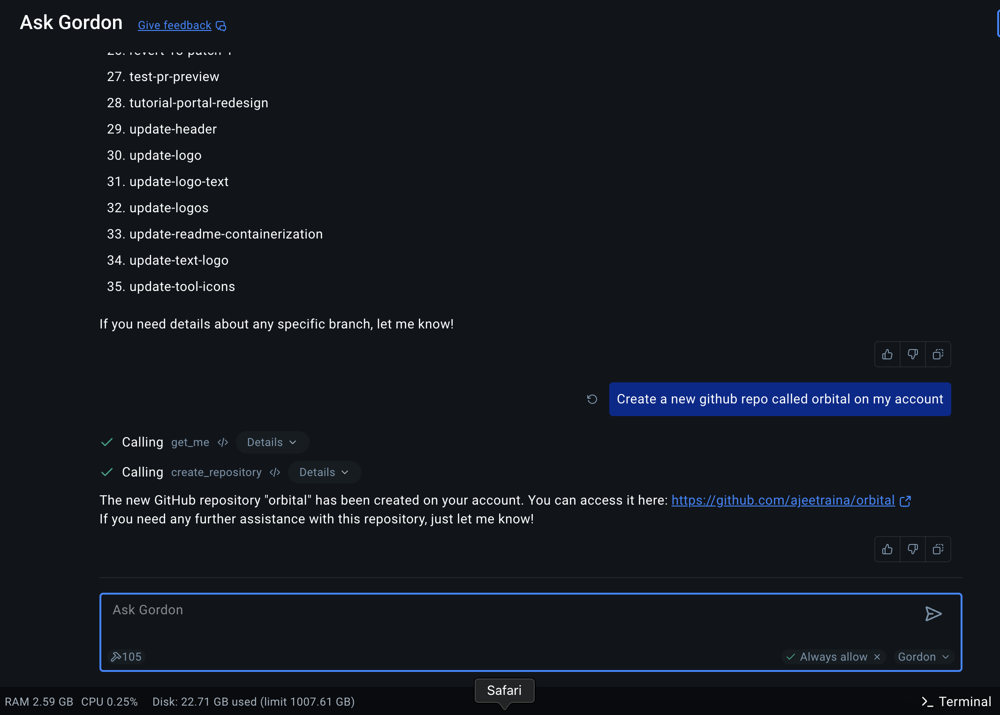
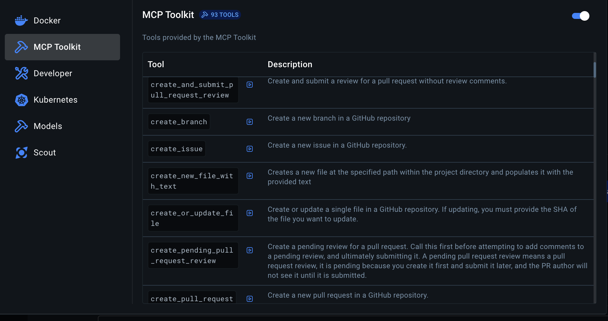

Let’s see how to use GitHub MCP Server using Gordon as well as Claude Desktop in the following steps:

## Step 1: Create a GitHub Personal Access Token (PAT)

- Go to GitHub.com and sign in to your account
- Click your profile picture in the top-right corner
- Select "Settings"
- Scroll down to "Developer settings" in the left sidebar
- Click on "Personal access tokens" → "Tokens (classic)"
- Click "Generate new token" → "Generate new token (classic)"
- Give your token a descriptive name like "Docker MCP GitHub Access"
- Select the following scopes (permissions):
 - repo (Full control of private repositories)
 - workflow (if you need workflow actions)
 - read:org (if you need organization access)
- Click "Generate token"

## Step 2: Configure the GitHub MCP Server in Docker

- Open Docker Desktop
- Navigate to the MCP Server
- Find the GitHub tool (official) card and click on it to expand details.

- Click on "Configuration" and enter your GitHub Personal Access Token (PAT) in the `github.personal_access_token` field.

If you have enabled Ask Gordon and enabled MCP Catalog (as shown in the following screenshot), then you can use docker ai command to play around with your GitHub repository.

## Step 3: Use Docker AI to create a new GitHub repository

This looks great! We've successfully used Docker AI to create a new GitHub repository called "modelorbital" on your GitHub account.

## Step 4. Continue using Gordon to interact with GitHub

Now, let's use Gordon to interact with GitHub. You can ask Gordon to perform various tasks related to your GitHub repositories.

