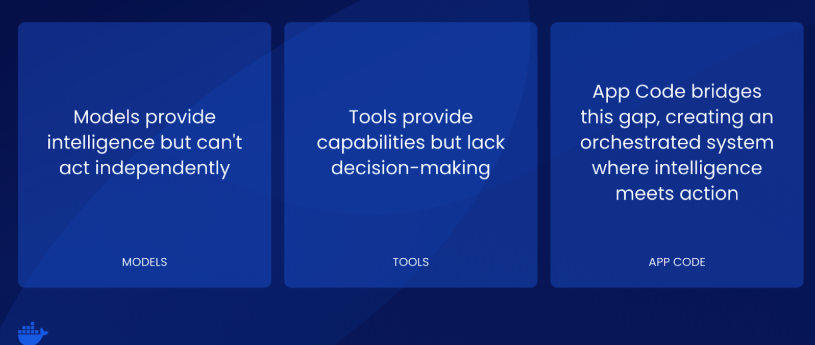

GenAI applications have evolved beyond simple text generation into sophisticated systems that actively reason, strategize, and execute complex workflows autonomously. We call it "agentic GenAI"—a shift from AI systems that primarily generate content to systems that can actively engage in the world, solve problems, and achieve goals autonomously. These agentic GenAI applications don't just process requests—they understand goals, decompose problems, and orchestrate solutions across multiple systems and services.

Whether you're building a customer service agent, a research assistant, or a multi-agent workflow system, all agentic GenAI applications share a consistent architectural foundation built on three essential layers:



- Models serve as the brains of the operation, generating output and determining how to achieve desired outcomes. 
- Tools provide the ability to fetch additional context or perform functions—it's important to note that models can't actually do anything on their own, as tools provide these critical capabilities. 

- Custom app code connects and orchestrates everything, giving the model the list of available tools, performing execution of requested tools, managing state, and building prompts. 

While this architecture appears straightforward, deploying these interconnected layers in production creates a cascade of complex challenges that traditional containerization approaches struggle to address.

## Why Deploying agentic GenAI apps is Harder Than It Should Be

Building agentic GenAI applications is exciting—getting them to work together in production is a nightmare. 
Most organizations start by running individual agentic components manually: one agent does research, another analyzes data, third handles conversations. Each component runs separately, needs its own setup, and requires constant babysitting. What begins as a simple demo quickly becomes an unmanageable collection of processes that break frequently and are impossible to monitor effectively.

When these agentic systems need to work together, the complexity explodes. Imagine trying to coordinate a team where everyone speaks a different language, uses different tools, and has no shared calendar. That's essentially what happens with agentic GenAI applications—they need to pass information between each other, handle failures gracefully, and adapt when things go wrong. Without proper coordination, you end up spending more time managing the infrastructure than benefiting from the intelligence.
The resource challenge makes everything worse. Agentic GenAI applications are hungry for computing power, especially GPU resources. While tools like Docker Model Runner help run models locally, most development machines can't handle multiple agentic systems simultaneously. A single modern AI model might need 3.5GB of video memory just to start, and production systems need much more. Teams often find themselves choosing between running applications locally with toy models or jumping straight to expensive cloud infrastructure with no middle ground.

Without standards, every pair of agentic systems that need to communicate invents its own communication method. Some use web requests, others use message queues, and some use entirely different protocols. Debugging becomes impossible because there's no single place to see what's happening across your agentic network. Security, monitoring, and troubleshooting all become exponentially harder as you add more agentic components to the mix.

## Introducing Agentic Compose

Agentic Compose solves these production deployment challenges by providing a comprehensive Docker Compose framework specifically designed for orchestrating agentic GenAI applications. This approach transforms chaotic infrastructure management into elegant, declarative patterns that scale from development to enterprise production.


Agentic Compose is a comprehensive Docker Compose framework specifically designed for orchestrating agentic GenAI applications in production. It provides declarative infrastructure management for the three essential layers of agentic AI systems—Models, Tools (via MCP Gateway), and App Code—enabling teams to deploy complex multi-agent workflows with the same simplicity as traditional containerized applications. 

While Docker Model Runner enables developers to run LLMs locally with simple commands and OpenAI-compatible APIs, the reality of GPU-intensive AI workloads creates unique orchestration challenges. Even with local model serving capabilities, most development environments lack the substantial GPU resources required for multi-agent systems (often needing 3.5GB+ VRAM per model, with production systems requiring significantly more). 

This creates a critical need for seamless workflows that work consistently from local development using Docker Model Runner to cloud-based GPU infrastructure using solutions like Docker Offload for production workloads.

## What’s New in Agentic Compose

### 1. The Old Vs New Model Definition and Management

#### The Old Model Definition and Management

Previously, models were defined as services using a provider mechanism. 

```
services:
  llm:
    provider:
      type: model
      options:
        model: ai/gemma3
```

While this approach worked, it created unnecessary complexity and didn't align with how developers naturally think about models as shared resources. To help the ecosystem evolve and provide a more intuitive experience, we've decided to define models more concretely by giving them a top-level field in the Compose specification.

#### 2. The New Model Definition and Management

In Agentic Compose, you can define one or more models for your GenAI app to use through a straightforward, declarative approach. 

The top-level models field in your Compose file defines the available models, making them easily discoverable and reusable across your entire application stack.


```
services:
  agent-app:
    ...
    models:
      gemma3:
        endpoint_var: OPENAI_BASE_URL
        model_var: OPENAI_MODEL
models:
  gemma3:
    model: ai/gemma3
```

Each service can specify the model it needs and the environment variables that should be injected to establish the connection. This approach provides clean separation between model configuration and service logic—services simply declare their model requirements, while the infrastructure handles the complexity of making those models available.

When you launch your Compose file, the Docker Model Runner automatically figures out how to ensure the model is accessible, regardless of whether you're running in Docker Desktop or deploying to production infrastructure.


The Model Runner intelligently handles the underlying complexity:
- Docker Desktop users benefit from seamless integration with local GPU resources and model caching
- Production environments automatically provision appropriate model containers or connect to external model services
- Environment variables are automatically injected based on your model configuration, eliminating manual setup steps

This abstraction means developers can focus on building their agentic logic rather than wrestling with model deployment intricacies. Whether you're using a lightweight local model for development or connecting to enterprise-grade model services in production, the same Compose configuration works consistently across all environments.

The result is a unified approach where model dependencies are as easy to manage as any other service dependency in your Docker Compose stack.

### 2. MCP Gateway: A New Standardized Tool Integration


To support the definitions of tooling in GenAI applications, we're open-sourcing and making the MCP Gateway available as a standalone container. This represents a major advancement in how tools are managed and integrated across agentic systems. With Agentic Compose, you can start an MCP gateway that will launch containerized MCP servers, handle credentials securely, and provide a standardized interface for tool interactions.

```
services:
  agent-app:
    ...
    environment:
      - MCPGATEWAY_ENDPOINT=http://mcp-gateway:8811/sse
    depends_on:
      - mcp-gateway

  mcp-gateway:
    image: docker/mcp-gateway:latest
    use_api_socket: true
    command:
      - --transport=sse
      - --servers=duckduckgo
      - --tools=search,fetch_content
```

-  Simplified Tool Configuration

Use the MCP Gateway container directly in your Compose stack by specifying the servers and tools your agents need to use. The configuration is straightforward—you define which MCP servers to launch and which specific tools to make available. The gateway handles all the complexity of server lifecycle management, tool discovery, and secure communication protocols. There are lots of other flags and options available for advanced configurations—check the docs and content kit for more details on customizing your tool setup.

-  Enhanced Security and Access Control

The new use_api_socket field provides a powerful capability by injecting both the Docker socket and registry credentials into the MCP Gateway. This enables private registry pulls and works seamlessly in enforced login environments, solving common deployment challenges in enterprise settings. The gateway can securely access private tool containers and handle authentication automatically, eliminating manual credential management.

-  Multi-Agent Tool Isolation

For applications with multiple agents, you can launch multiple MCP Gateway containers and networks to isolate tools appropriately. This ensures agents have access only to the tools they need, following the principle of least privilege. Each gateway can be configured with different tool sets, access permissions, and security policies, enabling fine-grained control over what capabilities each agent can access.

- Containerized Tool Ecosystem

The MCP Gateway transforms tool management from a configuration nightmare into a declarative infrastructure pattern. Tools become as easy to deploy and manage as any other containerized service, with benefits including automatic dependency resolution, version management, security isolation, and standardized communication protocols. This approach enables teams to build robust tool ecosystems that scale from development to production while maintaining security and reliability standards.

### 3. App Code

The app code layer in Agentic Compose represents the most familiar part of the stack—these are "normal" containerized applications that developers already know how to build, deploy, and manage. There's nothing fundamentally new here from a Compose perspective, as this follows the same patterns and practices used for any containerized application. The power comes from how these applications integrate with the models and tools layers to create intelligent, autonomous systems.

- Framework-Driven Development

Many agentic apps will use a framework to manage the complex orchestration of flow, memory, and state that characterizes intelligent applications. These frameworks handle the intricate details of prompt management, conversation history, tool selection, and execution coordination that would otherwise require significant custom development. Rather than building these capabilities from scratch, developers can leverage proven frameworks that provide robust foundations for agentic behavior.

- Rich Ecosystem Support

Our samples repository includes examples using several popular frameworks, demonstrating the flexibility and compatibility of Agentic Compose across the ecosystem:

- A2A - Agent-to-Agent communication patterns
- ADK - Agent Development Kit for rapid prototyping
- Agno - Lightweight agentic framework
- Crew AI - Multi-agent collaboration systems
- Embabel - Embedding and semantic search integration
- Langgraph - Graph-based agent workflows
- Spring AI - Enterprise Java integration
- Vercel - Modern web application deployment

- Seamless Integration

The beauty of this approach is that your existing containerization knowledge directly applies to agentic applications. Your app code simply needs to connect to the models and tools defined in your Compose file through standard environment variables and network connections. The frameworks handle the complexity of agentic behavior, while Compose handles the infrastructure complexity, allowing developers to focus on building the unique business logic and user experiences that define their applications.
This familiar development model dramatically reduces the learning curve for teams adopting agentic technologies, making it possible to leverage existing Docker expertise while building cutting-edge intelligent applications.

Here’s how a typical Compose file would look like 

File: compose.yaml

```json
# Docker Compose configuration for Simple Node.js MCP Agent
services:
  app:
    build:
      context: .
      dockerfile: Dockerfile
    ports:
      - "3000:3000"
    environment:
      - PORT=3000
      - MCP_GATEWAY_URL=http://mcp-gateway:8811
    depends_on:
      - mcp-gateway
    models:
      gemma:
        endpoint_var: MODEL_RUNNER_URL
        model_var: MODEL_RUNNER_MODEL

  mcp-gateway:
    # Standard MCP Gateway configuration
    image: docker/mcp-gateway:latest
    use_api_socket: true
    ports:
      - "8811:8811"
    command:
      - --transport=sse
      # Add any MCP servers you want to use
      - --servers=duckduckgo
      - --tools=search,fetch_content

# Model configuration
models:
  gemma:
    model: ai/gemma3-qat
```

File: compose-offload.yaml

```json
# Override for using Docker Offload with larger models
# Usage: docker compose -f compose.yaml -f compose.offload.yaml up --build

services:
  app:
    # Override with larger model configuration
    models:
      gemma-large:
        endpoint_var: MODEL_RUNNER_URL
        model_var: MODEL_RUNNER_MODEL

models:
  gemma-large:
    # Larger model for enhanced reasoning (requires 16+ GB VRAM)
    model: ai/gemma3:27B-Q4_K_M
    context_size: 8192
```

File: compose-openai.yaml

```json
services:
  agents:
    environment:
      - OPENAI_MODEL_NAME=gpt-4.1-mini
    secrets:
      - openai-api-key

secrets:
  openai-api-key:
    file: secret.openai-api-key
```

| **Use Case**                      | **Command**                                                                 |
|----------------------------------|------------------------------------------------------------------------------|
| Local Development (Docker Desktop) | `docker compose up -d --build`                                              |
| Docker Offload with GPU Support  | `docker compose -f compose.yaml -f compose.offload.yaml up --build`         |
| Using OpenAI Integration         | `docker compose -f compose.yaml -f compose.openai.yaml up --build`          |


