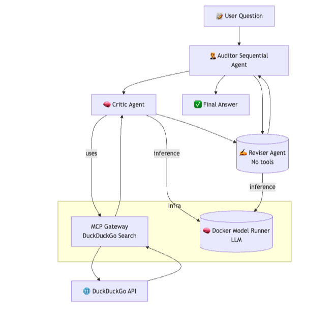
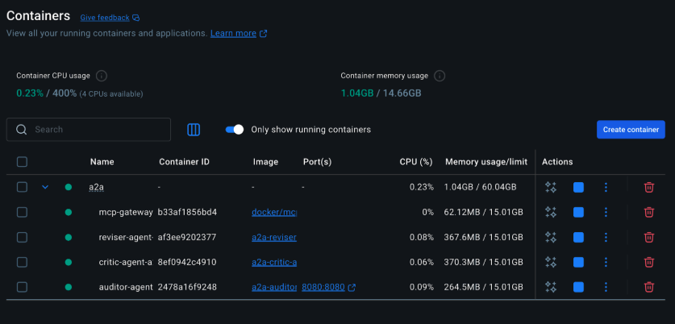
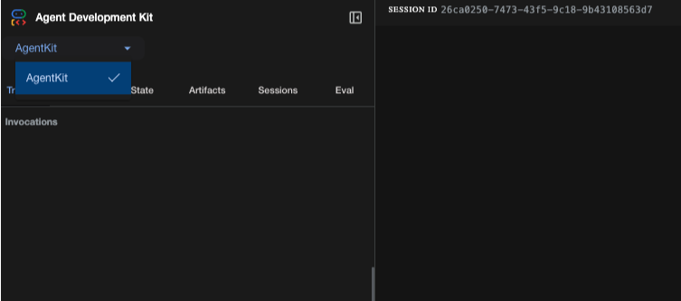

## Project Overview

The A2A Multi-Agent Fact Checker is a sophisticated demonstration of collaborative multi-agent systems built with Google's Agent2Agent SDK (A2A). This project showcases how specialized AI agents can work together under orchestration to verify facts and claims through a combination of external research and internal reasoning.

## What Makes This Special?
- Zero Configuration: Run with a single Docker command
- Local LLM Inference: Uses Docker Model Runner (no API keys required)
- Real-time Web Search: Integrates DuckDuckGo via Model Context Protocol (MCP)
- Orchestrated Workflow: Demonstrates true agent collaboration
- Modular Architecture: Each agent has distinct roles and capabilities

## Architecture Overview



| **Agent Role** | **Agent** | **Tools Used**        | **Role Description**                                                           |
|----------------|-----------|------------------------|---------------------------------------------------------------------------------|
| Auditor        | ❌ None    | None                   | Coordinates the entire fact-checking workflow and delivers the final answer.   |
| Critic         | ✅ DuckDuckGo via MCP | DuckDuckGo via MCP | Gathers evidence to support or refute the claim.                               |
| Reviser        | ❌ None    | None                   | Refines and finalizes the answer without external input.                       |


### Getting Started
Before running the project, ensure you have:

- Docker Desktop 4.43.0+ or Docker Engine installed
- A laptop or workstation with a GPU (e.g., MacBook) for running models locally
- Compose 2.38.1+ (if using Docker Engine on Linux)
- GPU drivers properly installed for your system

### Run the project

```json
cd compose-for-agents/a2a
docker compose -f compose.yaml -f compose.offload.yaml up --build
```

By now, you should be able to see the containers as shown in the Docker Dashboard.



Open [http://localhost:8080/dev-ui/?app=AgentKit](http://localhost:8080/dev-ui/?app=AgentKit) in your browser to access the AgentKit UI, where you can interact with the agents.



### Prompt 1

Example 1: Scientific Fact Check

Input: "How far is moon from the earth?"

Workflow:

Auditor receives the question and plans the verification strategy
Critic searches DuckDuckGo for current scientific theories and evidence
Reviser analyzes the gathered evidence and forms a reasoned conclusion
Auditor presents the final verdict with supporting evidence

### Prompt 2

Example 2: Current Events Check

Input: "What is the current status of renewable energy adoption globally?"

Workflow:

Auditor identifies the need for recent data
Critic searches for latest statistics and reports
Reviser synthesizes multiple sources into coherent trends
Auditor provides up-to-date analysis with data backing