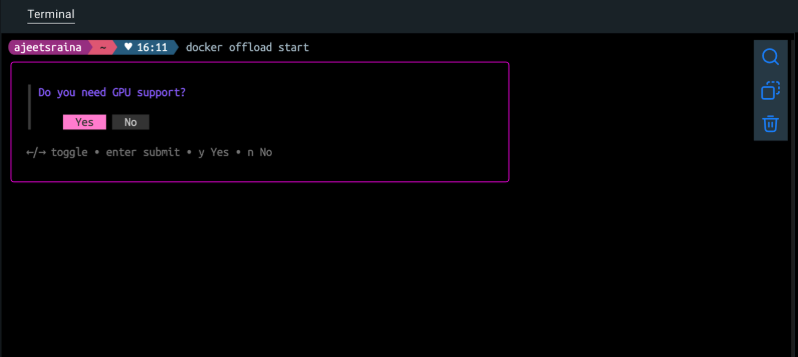
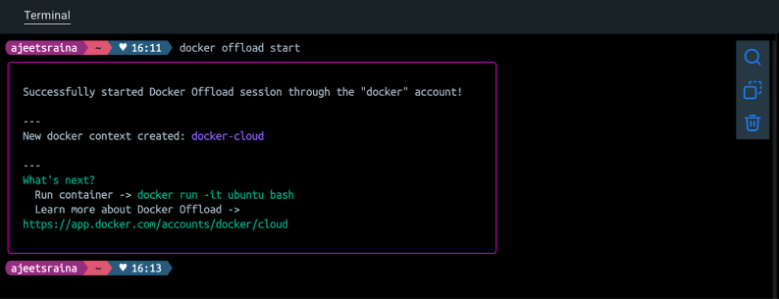
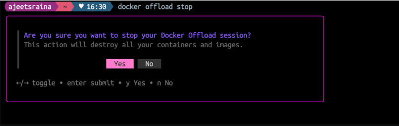
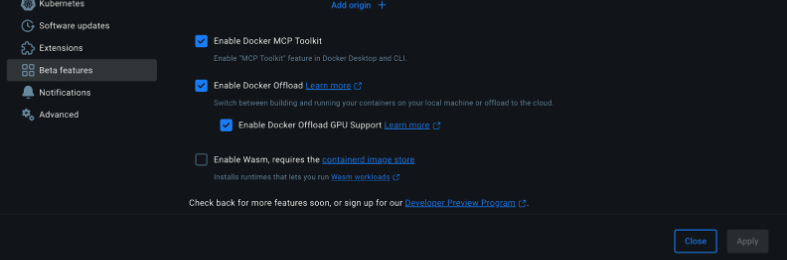
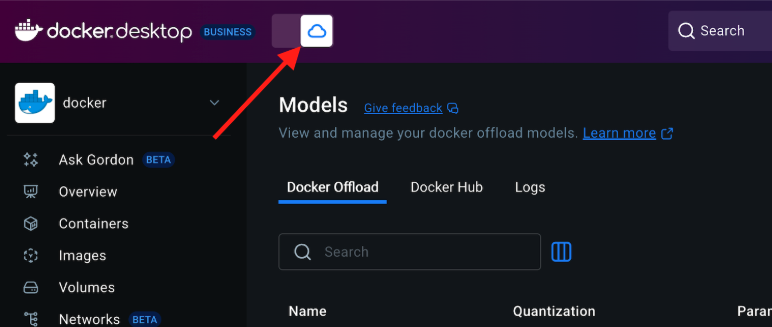
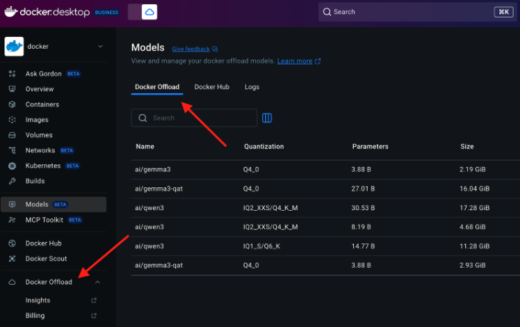

- Install Docker Desktop 4.43.0+
- Open the terminal and run the following command:

```json
docker offload
Usage:  docker offload COMMAND

Docker Offload

Commands:
  accounts       Prints available accounts
  diagnose       Print diagnostic information
  start          Start a Docker Offload session
  status         Show the status of the Docker Offload connection
  stop           Stop a Docker Offload session
  version        Prints the version

Run 'docker offload COMMAND --help' for more information on a command.
```

## Start a Docker Offload session

```json
docker offload start
```


Please choose your Hub account and proceed further.

## Enable or disable GPU support based on your preference.

!Tip: If you choose to enable GPU support, Docker Offload will run in an instance with an NVIDIA L4 GPU, which is useful for machine learning or compute-intensive workloads.


It starts Docker Offload session through the `docker` account.



Verify if a new `docker-cloud` context is created or not.

```json
docker context ls
NAME             DESCRIPTION                                      DOCKER ENDPOINT                                             ERROR
default          Current DOCKER_HOST based configuration          unix:///var/run/docker.sock                                 
desktop-linux    Docker Desktop                                   unix:///Users/ajeetsraina/.docker/run/docker.sock           
docker-cloud *   docker cloud context created by version v0.4.2   unix:///Users/ajeetsraina/.docker/cloud/docker-cloud.sock   
tcd              Testcontainers Desktop                           tcp://127.0.0.1:49496   
```

By now, you should be able to able to print available accounts through CLI.

```json
docker offload accounts
{
  "user": {
    "id": "15ee357d-XXXX-4d39-87d9-dc3b697b3392",
    "fullName": "XXX",
    "gravatarUrl": "",
    "username": "XXX",
    "state": "READY"
  },
  "orgs": [
    {
      "id": "57b45934-74c0-11e4-XXX-0242ac11001b",
      "fullName": "Docker, Inc.",
      "gravatarUrl": "https://www.gravatar.com/avatar/XXXXXa68e?s=80&r=g&d=mm",
      "orgname": "docker",
      "state": "READY"
    },
    {
      "id": "96a075XXXXXX1a78b",
      "fullName": "",
      "gravatarUrl": "",
      "orgname": "XXXX",
      "state": "READY"
    }
  ]
}

```

## Check the status of Docker Offload.

```json
docker offload status
```

## Check the version

```json
docker offload version
Docker Offload v0.4.2 build at 2025-06-30
```

## Stop the Docker Offload



This command removes `docker-cloud` instance from your system.

## Using Docker Offload using Docker Dashboard

- Navigate to Settings > Beta Features to enable Docker Offload.


- Once enabled, you will need to hit the toggle button to start Docker Offload.



- You can check the status by running the following command:

```json
docker offload status
```


- You’ll notice that Docker Offload appears in multiple places
   Under Models
   On the left sidebar of the Docker Dashboard



- Verify if you’re using Cloud instance through Docker Offload.

```json
docker info | grep -E "(Server Version|Operating System)"
 Server Version: 28.0.2
 Operating System: Ubuntu 22.04.5 LTS
ajeetsraina  ~  ♥ 16:54
```

- You can verify the type of GPU that your remote instance is leveraging.

```json
docker run --rm --gpus all nvidia/cuda:12.4.0-runtime-ubuntu22.04 nvidia-smi
```


Results:

```json
==========
== CUDA ==
==========

CUDA Version 12.4.0

Container image Copyright (c) 2016-2023, NVIDIA CORPORATION & AFFILIATES. All rights reserved.

This container image and its contents are governed by the NVIDIA Deep Learning Container License.
By pulling and using the container, you accept the terms and conditions of this license:
https://developer.nvidia.com/ngc/nvidia-deep-learning-container-license

A copy of this license is made available in this container at /NGC-DL-CONTAINER-LICENSE for your convenience.

Fri Jul  4 11:26:11 2025       
+---------------------------------------------------------------------------------------+
| NVIDIA-SMI 535.247.01             Driver Version: 535.247.01   CUDA Version: 12.4     |
|-----------------------------------------+----------------------+----------------------+
| GPU  Name                 Persistence-M | Bus-Id        Disp.A | Volatile Uncorr. ECC |
| Fan  Temp   Perf          Pwr:Usage/Cap |         Memory-Usage | GPU-Util  Compute M. |
|                                         |                      |               MIG M. |
|=========================================+======================+======================|
|   0  NVIDIA L4                      Off | 00000000:31:00.0 Off |                    0 |
| N/A   44C    P0              27W /  72W |  20200MiB / 23034MiB |      0%      Default |
|                                         |                      |                  N/A |
+-----------------------------------------+----------------------+----------------------+
                                                                                         
+---------------------------------------------------------------------------------------+
| Processes:                                                                            |
|  GPU   GI   CI        PID   Type   Process name                            GPU Memory |
|        ID   ID                                                             Usage      |
|=======================================================================================|
+---------------------------------------------------------------------------------------+
 

```

It shows NVIDIA L4 GPU with 23GB of memory. You can find further details:
- GPU: NVIDIA L4 (great for AI/ML workloads)
- Memory: 23GB total, ~20GB already allocated
- Driver: 535.247.01 with CUDA 12.4 support
- Current Usage: 0% (idle)
