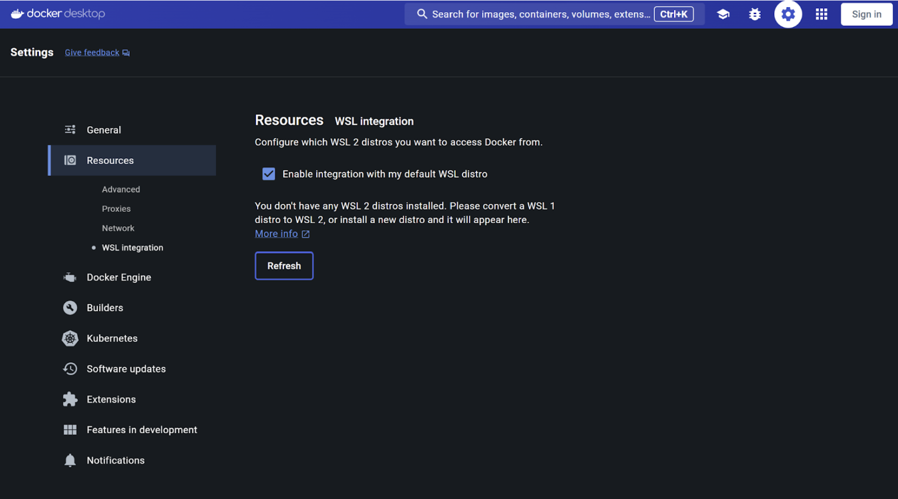

### 1. Docker Desktop

[Download and Install Docker Desktop 4.77.0+](https://www.docker.com/products/docker-desktop/) on your system. 

 - [Apple Chip](https://desktop.docker.com/mac/main/arm64/Docker.dmg)
 - [Intel Chip](https://desktop.docker.com/mac/main/amd64/Docker.dmg)
 - [Windows with NVIDIA GPUs](https://desktop.docker.com/win/main/amd64/Docker%20Desktop%20Installer.exe)
 - [Linux](https://docs.docker.com/desktop/linux/install/)


### 2. Download your preferred IDEs (optional)

- IntelliJ IDEA
- VS Code

### 3. Enabling WSL 2 / Hyper V based engine on Docker Desktop for Windows


In case you're using Windows 11, you will need to enable WSL 2 by opening Docker Desktop > Settings > Resources > WSL Integration



### 4. Install Nodejs

To demonstrate the container-first development workflow, you will require Nodejs installed on your system.


> Note: You must download and install the Node pre-built installer on your local system to get the npm install command to work seamlessly. [Click here to download](https://nodejs.org/en/download/)

### 5. Access to the repositories


- [https://github.com/dockersamples/catalog-service-node](https://github.com/dockersamples/catalog-service-node)
- [https://github.com/dockersamples/genai-model-runner-metrics](https://github.com/dockersamples/genai-model-runner-metrics)
- [https://github.com/ajeetraina/catalog-service-node-chatbot](https://github.com/ajeetraina/catalog-service-node-chatbot)
- [https://github.com/ajeetraina/catalog-service-ai-enhanced](https://github.com/ajeetraina/catalog-service-ai-enhanced)
- [https://github.com/dockersamples/visual-chatbot](https://github.com/dockersamples/visual-chatbot)
- [https://github.com/ajeetraina/pen-shop-demo](https://github.com/ajeetraina/pen-shop-demo)

### 6. Enable Docker Model Runner (For Docker AI workshop)

```
docker desktop enable model-runner
```

### 7. Download the models (For Docker AI workshop)

Ensure that you have sufficient space to download these models on your Macbook.

```
docker model pull ai/llama3.2:1B-Q8_0
docker model pull hf.co/menlo/jan-nano-gguf:q4_k_m
docker model pull hf.co/menlo/lucy-gguf:q8_0
```

### 8. Docker Labspace CLI installed on your system 

Install Labspace CLI using this link [https://github.com/docker/docker-labspace-cli](https://github.com/docker/docker-labspace-cli) 


