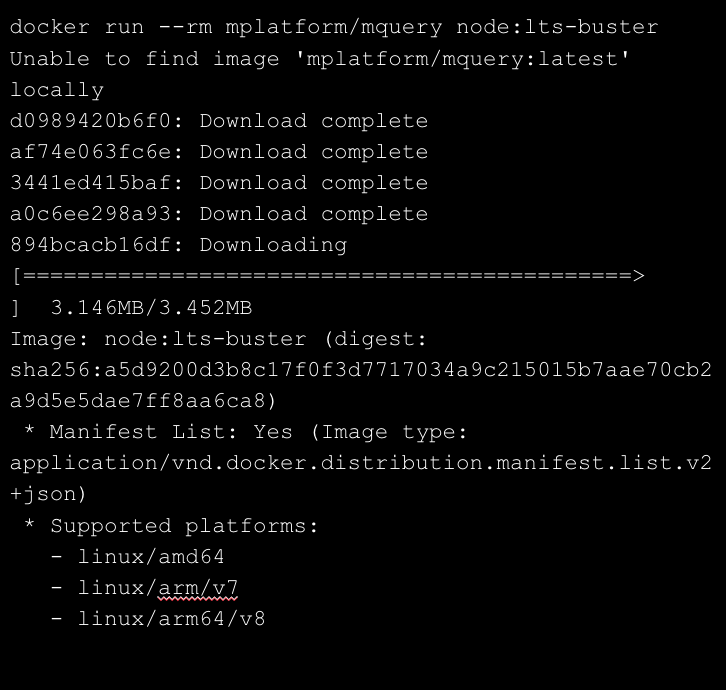

## **1. Use explicit base image reference instead of the latest**

Developers are often led to believe that specifying the latest tag will provide them with the most recent image in the repository but it has some side effects.

Image tags are mutable, meaning a publisher can update a tag to point to a new image. For example, if you specify FROM node:latest in your Dockerfile, it might resolve to the latest patch version for 18.11. However, if you rebuild the image 3 months later, the same tag might point to a different version, such as 18.13. This could result in breaking changes, and it means you also don't have an audit trail of the exact image versions that you're using.. 


## **2. Prefer leaner Docker Images**

Using leaner Docker images can help reduce the size of the final image, which can lead to faster build times, smaller storage footprint, and quicker deployment times.

For example, try to use Slimmer Images. Select smaller images for your FROM instructions in your Dockerfile. For example, the `node:16.17.0-slim image is a minimal Docker image that provides all of the OS utilities you would expect from a Linux container. There's also the special scratch image, which contains nothing at all and is useful for creating images of statically linked binaries (source).


## **3. Use Multi-stage builds**

Multi-stage builds let you reduce the size of your final image, by creating a cleaner separation between the building of your image and the final output. Split your Dockerfile instructions into distinct stages to make sure that the resulting output only contains the files that's needed to run the application.

Using multiple stages can also let you build more efficiently by executing build steps in parallel.


## **4. Quickly identify and fix vulnerabilities during the Build time using Docker Scout**

Container images consist of layers and software packages, which are susceptible to vulnerabilities. These vulnerabilities can compromise the security of containers and applications.

Docker Scout is a solution for proactively enhancing your software supply chain security. By analyzing your images, Docker Scout compiles an inventory of components, also known as a Software Bill of Materials (SBOM). The SBOM is matched against a continuously updated vulnerability database to pinpoint security weaknesses.

Docker Scout image analysis is available by default for Docker Hub repositories. You can also integrate third-party registries and other services


## **5. Add Healthcheck in Dockerfile and Docker Compose**

You can add a healthcheck in both Dockerfile and Docker Compose file.
In a Dockerfile, you can use the HEALTHCHECK instruction. Here's an example:

```
HEALTHCHECK --interval=5m --timeout=3s \
  CMD curl -f http://localhost/ || exit 1
```

In this example, Docker will check every five minutes if a web-server is able to serve the site's main page within three seconds. If the command (curl -f http://localhost/ || exit 1) returns a non-zero code, the container is considered unhealthy (source).


In a Docker Compose file, you can use the healthcheck attribute under a service. Here's an example:

```
services:
  web:
    healthcheck:
      test: ["CMD", "curl", "-f", "http://localhost"]
      interval: 1m30s
      timeout: 10s
      retries: 3
```

In this example, Docker Compose will run the command curl -f http://localhost to check the health of the web service. It will do this every 1 minute and 30 seconds, and if the command doesn't return within 10 seconds or if it fails 3 times in a row, the service is considered unhealthy (source).


## **6. Use .dockerignore**


The .dockerignore file is used to exclude files and directories from the build context when building a Docker image. This can help to improve build speed and avoid sending unwanted files to the Docker builder. The syntax of the .dockerignore file is similar to the .gitignore file, with each line representing a pattern that matches files and directories to be excluded.

Here's an example of a .dockerignore file:

```
# .dockerignore
node_modules
bar
```

In this example, the node_modules directory and any file or directory named bar are excluded from the build context.

When you run a build command, Docker looks for a .dockerignore file in the root directory of the context. If this file exists, the files and directories that match patterns in the file are removed from the build context before it's sent to the builder.
If you have multiple Dockerfiles, you can use different .dockerignore files for each Dockerfile by using a special naming convention. You should place your .dockerignore file in the same directory as the Dockerfile, and prefix the .dockerignore file with the name of the Dockerfile. For example, for a Dockerfile named myapp.Dockerfile, you would create a .dockerignore file named myapp.Dockerfile.dockerignore.

```
.
├── index.ts
├── src/
├── docker
│   ├── build.Dockerfile
│   ├── build.Dockerfile.dockerignore
│   ├── lint.Dockerfile
│   ├── lint.Dockerfile.dockerignore
│   ├── test.Dockerfile
│   └── test.Dockerfile.dockerignore
├── package.json
└── package-lock.json
```

In this example, each Dockerfile has its own corresponding .dockerignore file. If both a Dockerfile-specific .dockerignore file and a .dockerignore file at the root of the build context exist, the Dockerfile-specific .dockerignore file takes precedence.


## **7. Run as non-root user for security purpose**

Running Docker as a non-root user is a good practice to mitigate potential vulnerabilities in the Docker daemon and the container runtime. Docker provides a feature called "Rootless mode" that allows running the Docker daemon and containers as a non-root user.


## **8. Favour Multi-Architecture Docker Images**


Using multi-architecture Docker images is beneficial as it allows your Docker images to run on different hardware architectures without any modifications. This means that whether you are using an ARM-based system or an x86 machine, Docker automatically detects and selects the appropriate variant for your host's operating system and architecture.

There are three strategies to build multi-platform images depending on your use case:
- Using emulation, via QEMU support in the Linux kernel.
- Building on a single builder backed by multiple nodes of different architectures.
- Using a stage in your Dockerfile to cross-compile to different architectures.

To build multi-platform images, you can use the --platform flag with the docker build command to define the target platforms for the build output, such as linux/amd64 and linux/arm64.  For example:

```
$ docker build --platform linux/amd64,linux/arm64 .
```

By default, Docker can build for only one platform at a time. To build for multiple platforms concurrently, you can enable the containerd image store or create a custom builder.
For example, to enable the containerd image store in Docker Desktop, go to Settings and select Use containerd for pulling and storing images in the General tab. If you're not using Docker Desktop, enable the containerd image store by adding the following feature configuration to your /etc/docker/daemon.json configuration file.

```
{
  "features": {
    "containerd-snapshotter": true
  }
}
```

Then, restart the daemon after updating the configuration file.

```
$ systemctl restart docker
```





