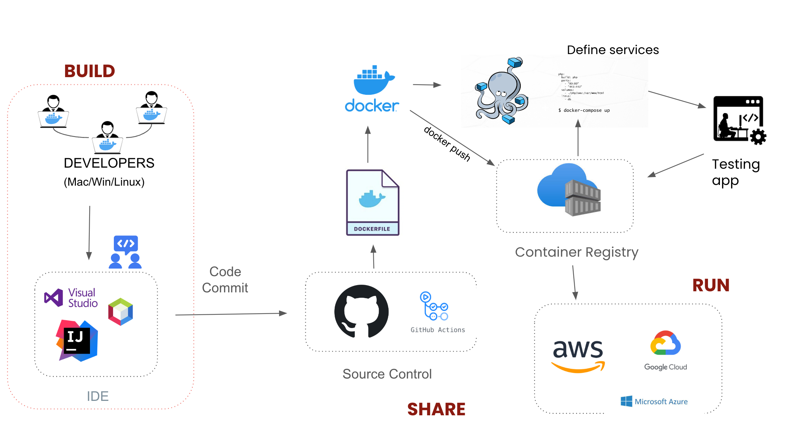

- **Build**: Typically a developer run `docker build` command to build an image from a Dockerfile, which is a text document that contains instructions for how to build the image.

- **Share**: Once a developer builds a Docker image, they can share it with others by pushing it to a container registry. You can use the `docker push` command to do this.

- **Run**: The `docker run` command lets you create and start a running container based on a Docker image.

## Docker Inner-Loop Development workflow

- **Development Environment**: As you deep-dive into the inner-loop development workflow, developers have their own choice anduse any operating system (OS) they prefer, like Windows, Mac, or Linux. They can also leverage their favorite Integrated Development Environments (IDEs) for coding. This flexibility empowers developers to work in a familiar and comfortable setting.

- **Building and storing the application** - Once the code is written, the developer uses GitHub Actions. GitHub Actions is a built-in automation tool in GitHub that allows you to automate tasks within your development workflow. In this context, the developer uses GitHub Actions to trigger the building of a Docker image. A Dockerfile, which is a set of instructions that specifies how to build the image, is used in this process.  After the image is built, it's uploaded to a container registry. A container registry acts as a library or repository that stores Docker images.

- **Deployment** - Finally, the image is deployed to the cloud. This means the image is uploaded to a cloud platform where it can be run on virtual machines. There are several cloud platforms available, including Google Cloud Platform, Amazon Web Services, and Microsoft Azure. The specific steps for deployment will vary depending on the chosen cloud platform. But generally, it involves using the cloud platform tools to run the Docker image and create a container instance. This container instance then executes the application.

